# Robo_Edu Image – USB Flash Drive Setup Guide

This guide explains how to prepare and install the customized **robo_edu** Image using two USB flash drives.

---

## USB Flash Drive Classification

| Drive | Purpose                                                                                                                                                   |
|-------|-----------------------------------------------------------------------------------------------------------------------------------------------------------|
| **USB Flash Drive A** | Used to **boot** into the customized Ubuntu image.                                                                                                        |
| **USB Flash Drive B** | Used to **install** the full **robo_edu** Image (this drive will be used later  to boot). Note that you need a USB stick with a good read and write speed |

---

### Part 1: Create Bootable USB (Drive A)

1. [Download](https://studentuef-my.sharepoint.com/:u:/g/personal/sajibpra_uef_fi/EfrmtK2wMiVBn089OKVlwpwBoFO5u9gVrpPSSj10R3VrUw?e=Ezqzve) the customized Ubuntu image.  
2. **Insert** USB Flash Drive **A** into your computer.  
3. **Create a bootable USB** using one of the following tools:
   - **Windows:** [Rufus](https://rufus.ie/en/)  
   - **Ubuntu/Linux:** Use the built-in **Startup Disk Creator** (`usb-creator-gtk`):

     ```bash
     sudo apt install usb-creator-gtk
     ```

---

### Part 2: Install the robo_edu Image (to Drive B)

Alright! So you have a live Ubuntu USB and an empty USB where you’ll be installing Ubuntu. Plug both of them to a computer. You have to boot from this live USB now and for that you’ll have to access the boot settings.

#### Step 1: Boot from live USB

Plug in both USBs to your system and restart it. When the system is booting and it shows the manufacturer’s logo, press F10/F12 keys repeatedly. Different manufacturers set different keys for accessing the BIOS settings.

Note: Some systems won’t allow booting from live USB if secure boot is on. If that’s the case, [disable secure boot](https://itsfoss.com/disable-secure-boot-windows/) first.

On my Dell system, the boot settings showed this screen. I have Debian installed on this system.

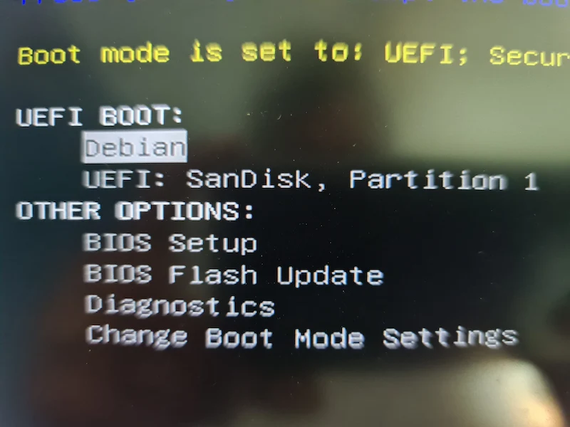

Boot from the live USB

When you are in the live session, go with “Try Ubuntu” option:


Go with Try Ubuntu option here

#### Step 2: Disable ESP flags from the ESP partition

Press the Windows key and type Gparted. This will open the Gparted partition manager which is (usually) already present on the Ubuntu ISO.


Start Gparted in Ubuntu

If it is not found, connect to the internet, open a terminal, run sudo apt update and then [install gparted on Ubuntu](https://itsfoss.com/gparted/).

In Gparted, make sure that you have selected the system’s disk. Look for the partition of around 100-500 MB in size and flagged as ESP. Right click on this partition and select ‘**Manage Flags’**:

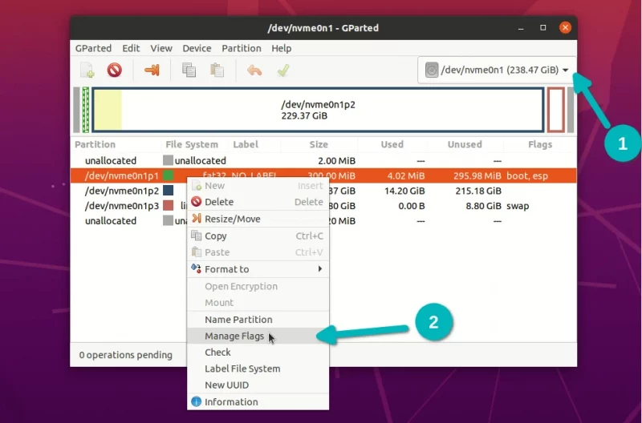

Reset flags for the ESP partition

It should show esp and boot flags. If there are more flags set, take a screenshot to revert to the same set of flags after the installation is complete.

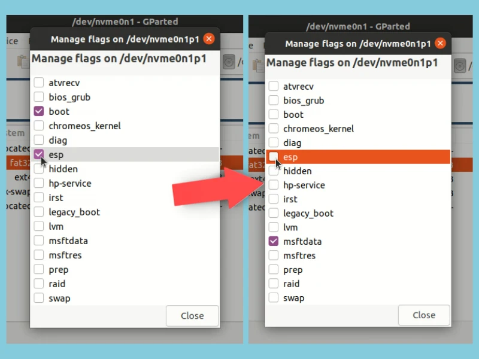

Remove esp flag from the ESP partition

Deselecting the flags usually adds a msftdata flag, and you can leave it like that. Changes take effect immediately.

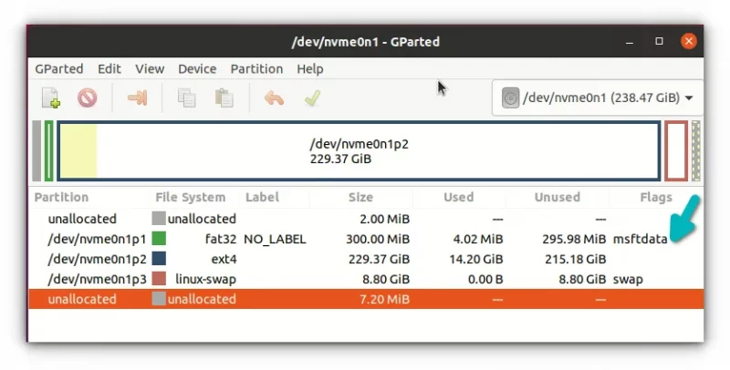

ESP flags removed from the ESP partition

Great! Now your live system does not see the ESP partition and thus the existing boot settings of the computer. Now is the time to start installing Ubuntu on the other USB.

#### Step 3: Installing Ubuntu on the other USB

Make sure that you have plugged in the other, bigger-capacity USB as well. Double-click on the "Install Ubuntu" icon on the desktop.

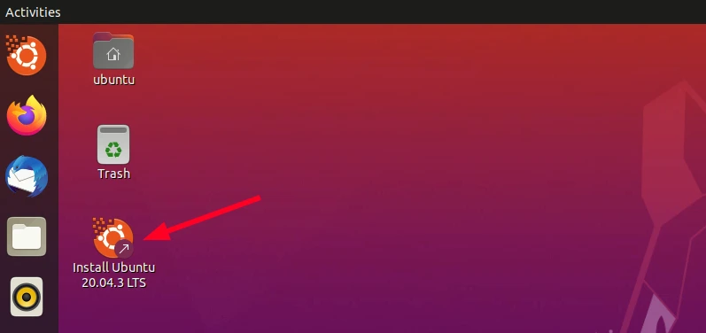

Start Ubuntu installation

It will start the installation. You can go through the first few steps of choosing the keyboard layout and language.


Choose your language / Choose keyboard layout

Remember, I told you in the beginning that it takes quite a long time in installing Ubuntu on a USB? For this reason, I suggest going for the minimal install here which comes with a browser and essential utilities but won’t include office software, media players etc. You can install them later.

Using Minimal Installation means copying less files on the USB and this will reduce the installation time.

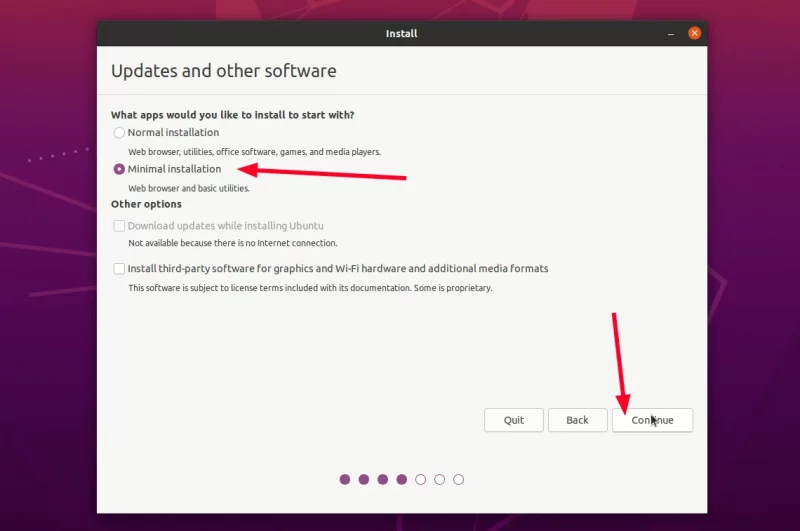

Selecting minimal install will reduce the installation time

On the next screen, select Something Else:

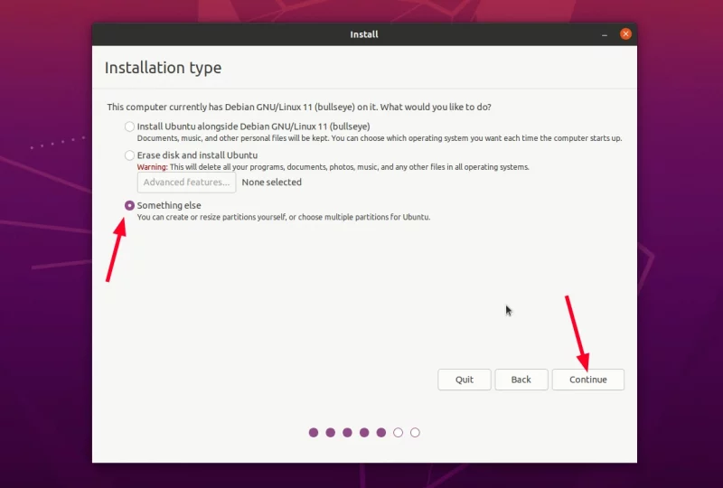

Something else option will let you access the disks and partition

On the ‘Installation type’ screen, you can see all the hard disk and the USB disks listed on the main interface. You can see that the hard disk doesn’t show an ESP partition because the flags have been removed.

What you should make sure here is that you have selected the correct USB (the bigger one) for “Device for bootloader installation”. I am using my external thunderbolt SSD here which is of 500 GB capacity (bigger than the hard disk of the laptop):

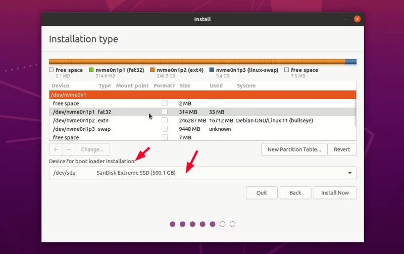

Location of the bootloader should be the external USB

Now, select the bigger USB and delete any existing partition to make free space by clicking the – button.

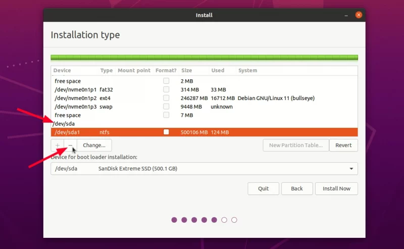

Make free space on the external USB for Ubuntu installation

Next, select the free space you just created and click the + sign to make partition on it.

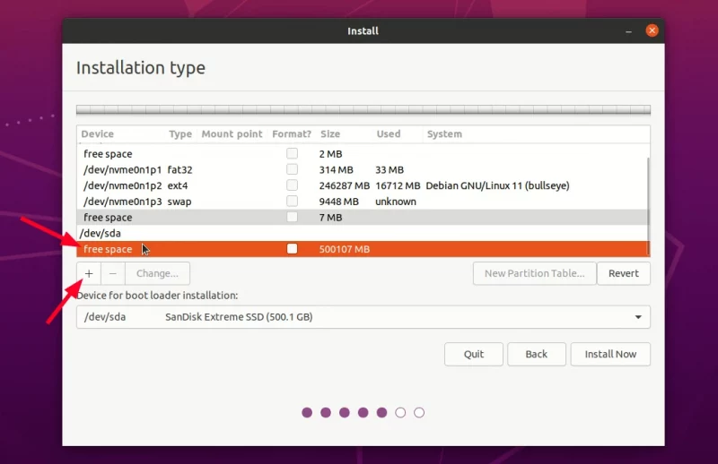

Create new partition on the external USB

Make the first partition as ESP for the bootloader.

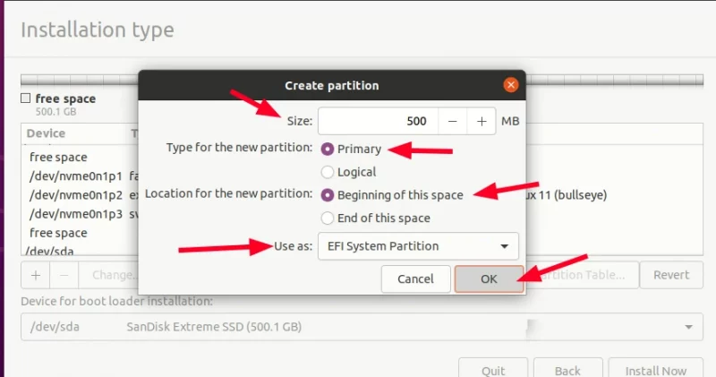

Create

Select the remaining free space and create root with Ext4 filesystem. You may also create root, swap and home but I suggest keeping everything under root including swap (thanks to [swapfile](https://itsfoss.com/create-swap-file-linux/)).

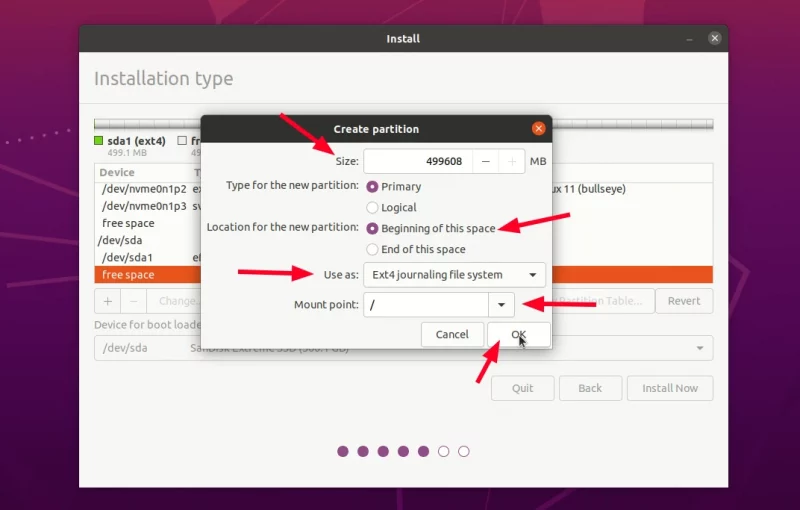

Create a root partition with ext4 filesystem

When you have the partitions ready, double check that external USB is chosen for the bootloader install.

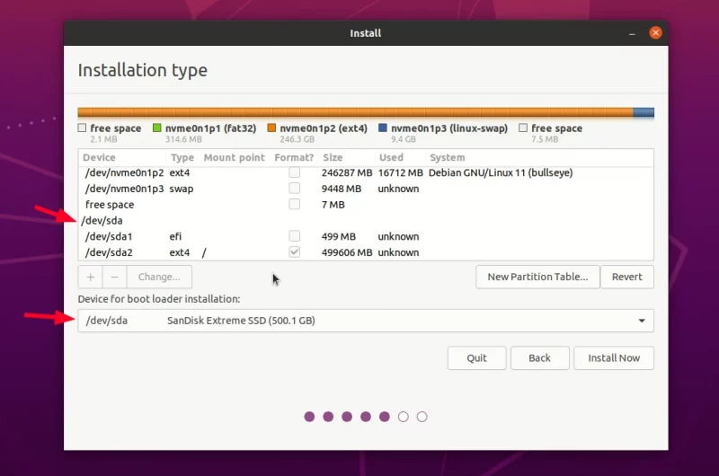

Double-check the bootloader location which should be on the external USB drive

Things are looking good. Hit the "install" button and go through the usual timezone settings.

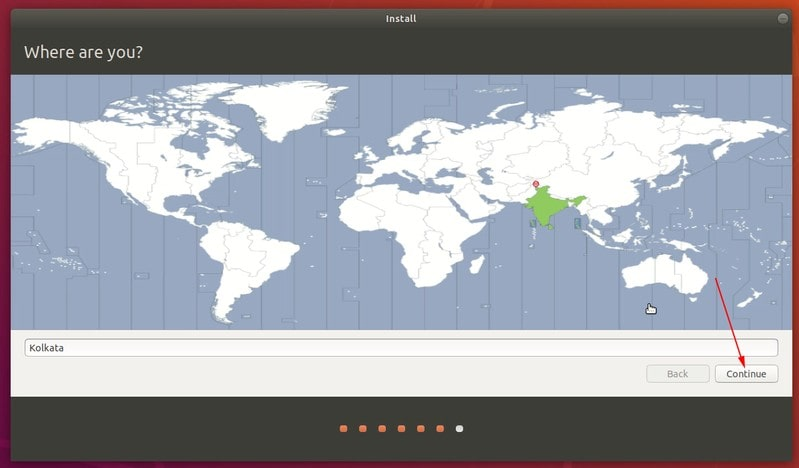

Select timezone

You’ll be asked to create user and password.

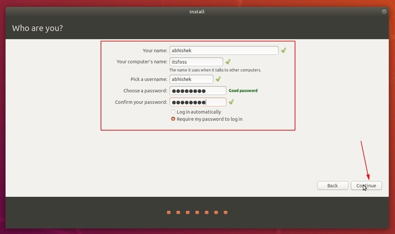

Set username and password

After this, it is all a matter of waiting. If you have ever installed Ubuntu, you’ll surely feel that this installation is slower than usual.

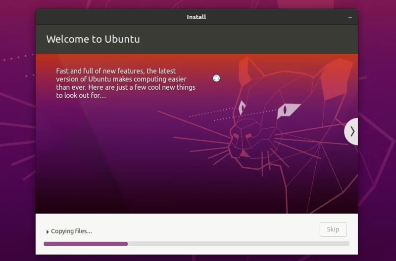

Ubuntu installation is in progress

When the installation finishes, DO NOT RESTART right away. You have to reset ESP partition back in its original state.


Continue using the live Ubuntu environment

#### Step 4: Re-enable ESP flags on the ESP partition

Start Gparted once again. Select the hard disk of your system and right click on its ESP partition which is now labelled as msftdata. Select esp flag and it should also select boot flag automatically.

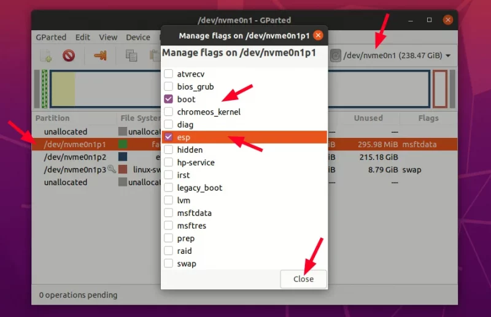

Set esp flags again

Congratulations! You have successfully installed actual Ubuntu on a flash drive. You can now turn off the live Ubuntu system.

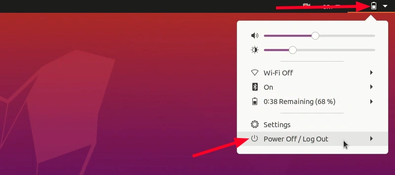

Restart or turn off the system now


**What if you accidentally hit the restart button without resetting the ESP flags?** That’s bad nut not too bad. Since your actual system does not have an ESP partition it won’t boot without the external USB you just created. But no need to worry. You still have the live Ubuntu USB, right? Boot from it again. Start Gparted and enable the correct flag on the ESP partition of the disk.

---

## How to Use the USB Flash Drive

Watch the full instruction video here:  
[Video](images/Instruction%20to%20use%20FlashDrive%20Ubuntu.mp4)

---

### Tips
- Use at least **64 GB** USB drives for optimal performance.  
- For best results, use **USB 3.0** drives.  
- Always **eject safely** before removing the drives.

---

### Getting your USBs back in normal condition

Here’s the thing you have used two USBs: one for live Ubuntu and one for actual Ubuntu install.

If you want to use either of the USBs later for normal data transfer, you’ll have a difficult time formatting them. When you create a live USB, it leaves the USB in a weird state and often operating systems cannot format it directly.

Gparted comes to the rescue once again. It is available for Linux, Windows and macOS. Download and install it and use it to format the USB by deleting all the partitions on it and creating a new partition in NTFS or FAT32 format.

---

## Acknowledgements
- [Abhishek Prakash](https://itsfoss.com/intsall-ubuntu-on-usb/)
- [Md Sajib Pramanic](https://www.linkedin.com/in/md-sajib-pramanic/). [Github](https://github.com/SAJIB3489).


---

**uef_robotics_xr_2025**
