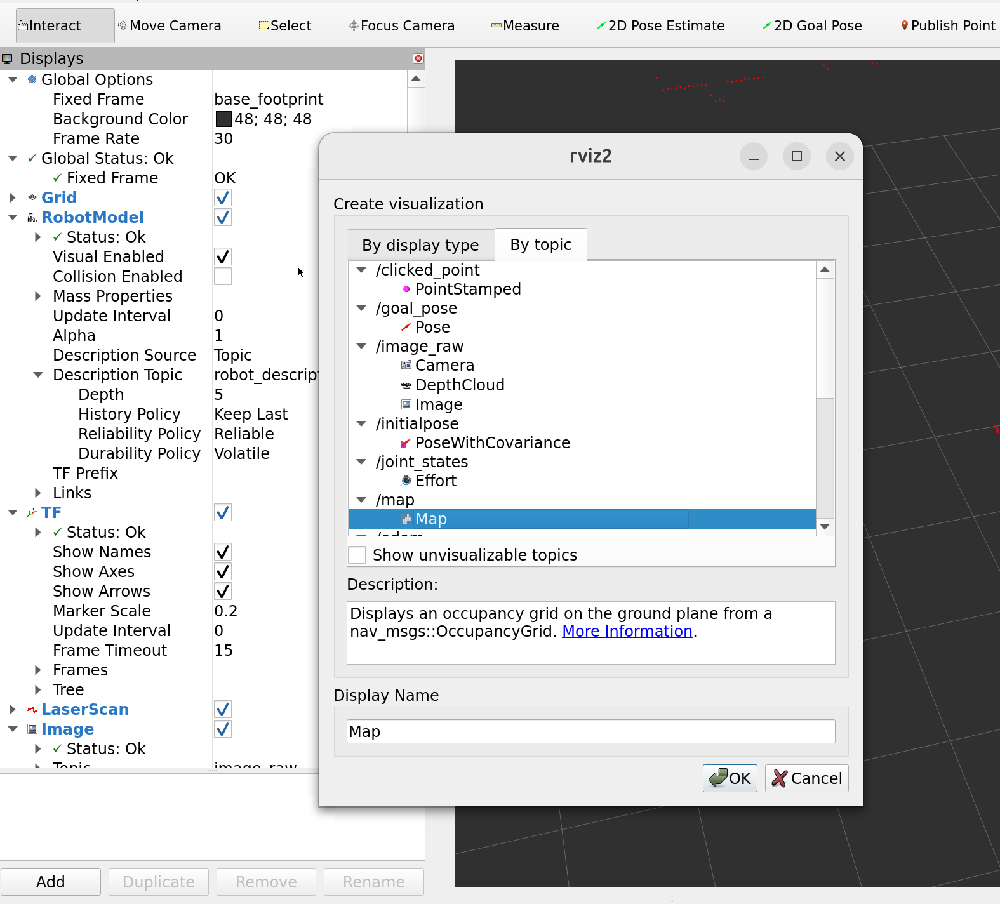
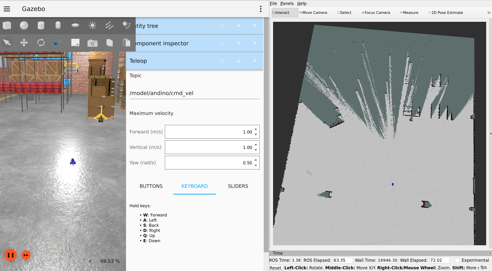
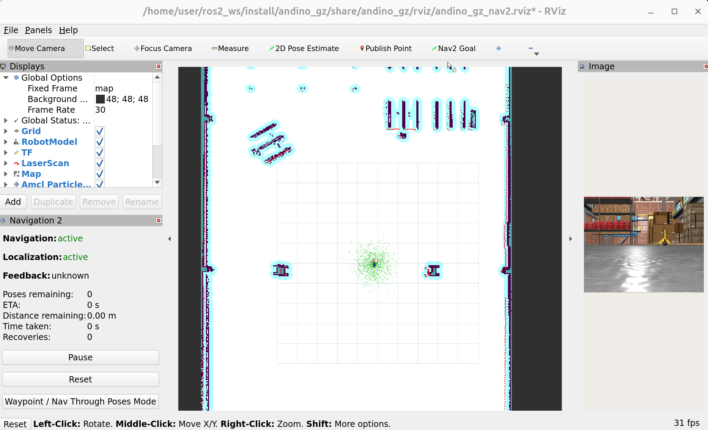

# Exercises 2 - SLAM and Navigation Demo
Now it is time to use the robot to build a new 2D map of the simulated environment and autonomously navigate on it.

<!-- TOC -->
* [Basic Concepts](#basic-concepts)
  * [Slam-toolbox](#slam-toolbox)
  * [Nav2](#nav2)
  * [AMCL](#amcl)
* [Mapping demo](#mapping-demo)
* [Autonomous navigation demo](#autonomous-navigation-demo)
* [ROS 2 Services](#ros-2-services)
* [Summary](#summary)
<!-- TOC -->

## Basic Concepts

### Slam-toolbox
[Slam-toolbox](https://github.com/SteveMacenski/slam_toolbox/tree/ros2) is an advanced 2D SLAM (Simultaneous Localization and Mapping) solution for ROS 2. 
It provides tools for online (real-time) and offline mapping, lifelong mapping, loop closure, and localization. 
Slam-toolbox is designed for both real-time applications and mapping large-scale environments efficiently.

### Nav2


[Nav2](https://github.com/ros-navigation/navigation2), or the Navigation2 stack, is a framework for ROS 2 that enables robots to navigate autonomously. 
It handles path planning, path following, obstacle avoidance, and localization in complex environments. 
Nav2 is modular, allowing developers to customize or replace components to suit specific robotic needs.

### AMCL
[AMCL](https://github.com/ros-navigation/navigation2/tree/main/nav2_amcl) (Adaptive Monte Carlo Localization) is a probabilistic localization system used in ROS 2, and is part of the Nav2 stack. 
It enables robots to determine their position within a known map using particle filters. 
AMCL uses sensor data, typically from a LiDAR, to refine the estimated pose of the robot as it navigates.


## Mapping demo
Next, we will run Andino in simulation and map the environment with it.

1. Run the simulation inside the Docker container ([How to run Docker container](/0-setup/Docker%20Cheat%20Sheet.md))

    ```commandline
    ros2 launch andino_gz andino_gz.launch.py
    ```

1. Open a new terminal inside the Docker container and run slam-toolbox ([How to open terminal in Docker container](/0-setup/Docker%20Cheat%20Sheet.md))
    
    ```commandline
    ros2 launch andino_gz slam_toolbox_online_async.launch.py
    ```
1. In RViz, subscribe to /map topic to view the map that is being built.
    
    

1. Use Gazebo teleop to drive the robot around in the simulation and map the area.
   
    

    **Tip:** You can right-click the robot in simulation and choose "Follow" -camera mode to better keep track of your robot.

1. Once you are satisfied with the map, open a new terminal inside the Docker container and run this command to save it:
    ```commandline
    ros2 run nav2_map_server map_saver_cli --free 0.15 --fmt png -f /home/user/andino_map
    ```

## Autonomous navigation demo

Before proceeding, stop the previous simulation and slam-toolbox runs with CTRL-C. Make sure you check all your open 
terminals to stop everything you had running before.

1. Open a new terminal inside the Docker container and launch the Andino simulation with Nav2
    ```commandline
    ros2 launch andino_gz andino_gz.launch.py nav2:=True
    ```

1. **Optional:** Navigation will start with a default Andino map. If you wish to switch to the map you just mapped, 
open a new terminal inside the container and call a ROS service:
   ```commandline
    ros2 service call /map_server/load_map nav2_msgs/srv/LoadMap "{map_url: /home/user/andino_map.yaml}"
   ```

1. Give a "2D Pose Estimate" for AMCL in RViz, so the robot has idea where it starts from.
   
    

    After this, you will see the robot's location on the map
    
    

1. Give a "Nav2 Goal" from RViz to start the autonomous navigation to a desired location on map. You will see the robot planning a path to the given location and start driving towards the goal
    
    


**Exercise 1:**

Play with Nav2 by giving different goals for the robot.
* Pay attention to what obstacles the robot is able to see with its laser scanner.
* Pay attention to the planned paths that the robot makes. Does it always follow them precisely?
* Are the planned paths always feasible? Does the robot get stuck?


## ROS 2 Services

If you changed Nav2 to use your 2D map, you might have noticed that you just called a ROS 2 service.
In addition to ROS 2 topics, services are a complementary communication method.
Instead of simply publishing and subscribing, services work using a request-response model.

Services can be called with a specific type of service request.
The request is processed and a response received as a result.
For example in the Nav2 demo, we called a `/map_server/load_map` service topic, to
load a new map, with a request of `"{map_url: /home/user/andino_map.yaml}"`, which has the type of `nav2_msgs/srv/LoadMap` message.

You can list all the available services with:
```commandline
ros2 service list
```

include also their message types with:
```commandline
ros2 service list -t
```

and call a service with:

```commandline
ros2 service call <service_topic> <message_type> <request>
```

## Summary

By the end of these exercises, you have now learned
- How to create a 2D map using slam-toolbox
- How make the robot autonomously navigate using Nav2
- What ROS 2 services are
