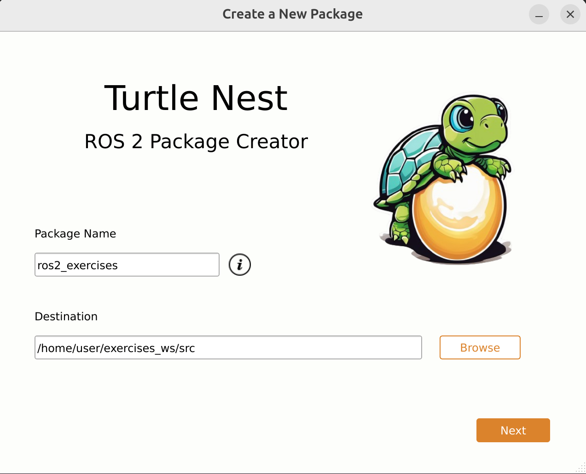
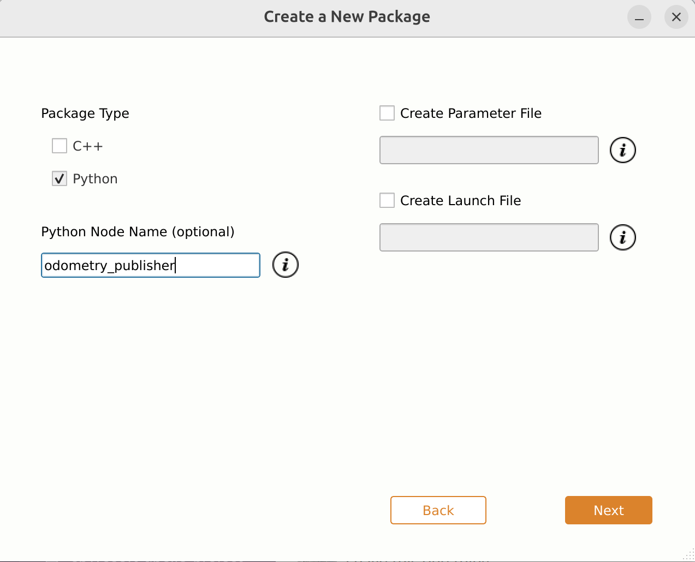
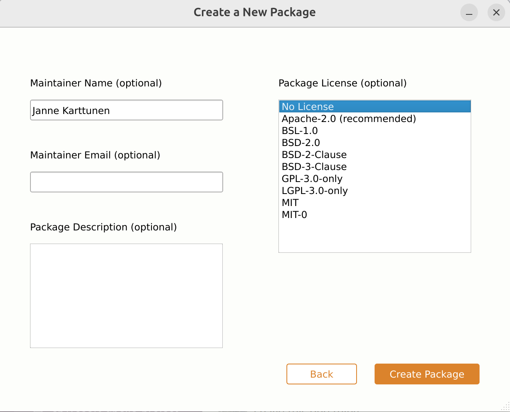
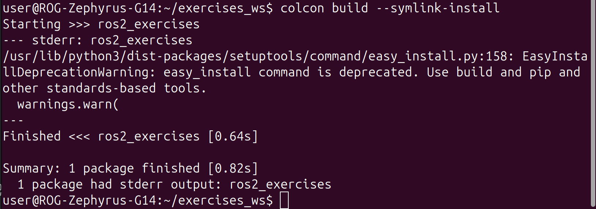
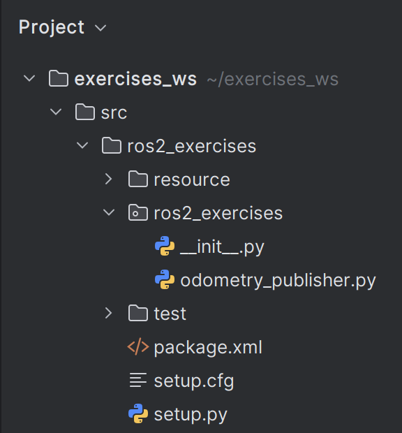
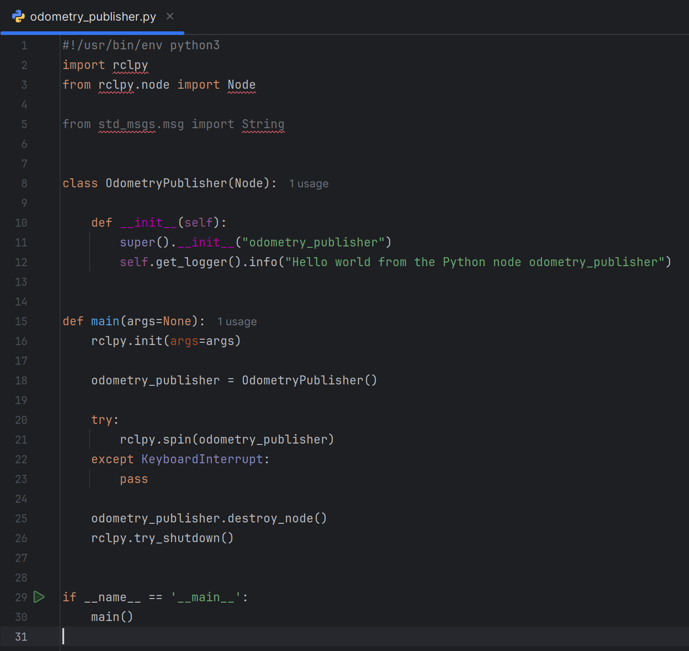
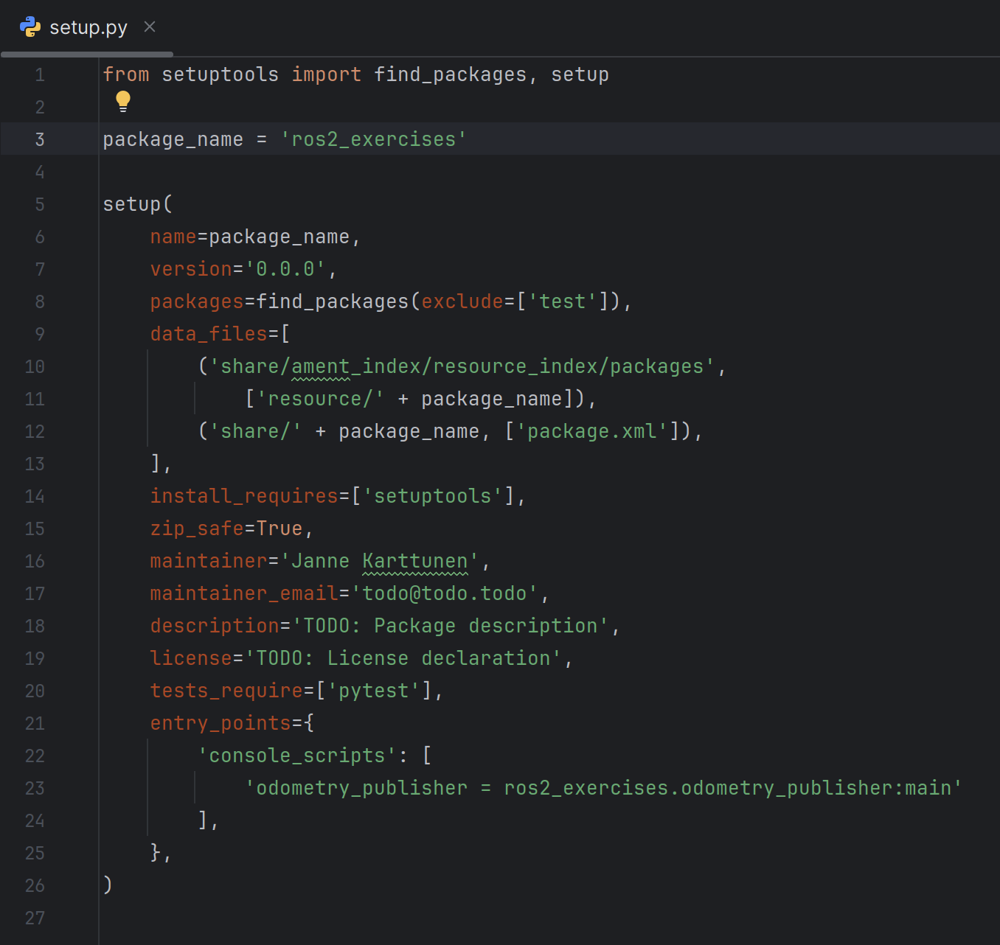
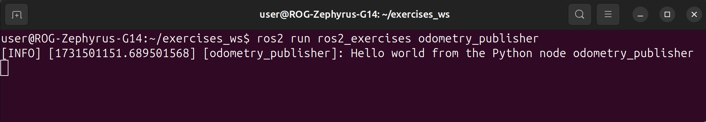

# Exercises 3 - Create ROS 2 package
In the upcoming exercise session, you will start writing some Python code.
ROS 2 organizes code neatly in **packages** to separate different 
functionalities, and make them to be easily installable and shareable.

You can follow this tutorial to easily create a new package using the 
[Turtle Nest](https://github.com/Jannkar/turtle_nest) GUI tool, or learn how to create packages manually from the command line by following 
[the official ROS 2 documentation](https://docs.ros.org/en/humble/Tutorials/Beginner-Client-Libraries/Creating-Your-First-ROS2-Package.html).

## Create a new package
1. Launch the Docker container and open a new terminal inside it ([How to run Docker container](/0-setup/Docker%20Cheat%20Sheet.md))
2. Run the command `turtle-nest` to bring up the guided package creation

Use the following settings to create the package:

**Package name:** `ros2_exercises`

**Destination:** Path to exercises_ws, for example: `/home/user/exercises_ws/src`

-> Next

**Package Type:** `Python`. Uncheck the C++ option

**Python Node Name:** `odometry_publisher` (Will be used for the next exercises)

-> Next

**Maintainer Name:** `<Your name>`

**Package License:** `No license`

-> Create Package

Other fields can be left empty / unchecked, as they are not needed in these exercises.

## Build and source the package

Next, you will need to compile your code by building the package and then source it for ROS 2 to be able to find it.
Run the following commands:

    cd /home/user/exercises_ws/
    colcon build --symlink-install
    source install/setup.bash

This will build and source all the packages inside your exercises_ws -workspace. 
We use the `--symlink-install` to make our Python code symbolically linked, so that we don't have to rebuild every time we modify our code.

**NOTE**: You need to do this build and source step every time you relaunch your Docker container!

After successfully building, you should see the following message. You can ignore the produced warning message.

## What our new package includes?

Let's check what our newly created package contains.

We created our package in the `exercises_ws` folder. 
This folder is mounted inside our container in the `volumes` section of our [docker-compose.yaml](/docker/docker-compose.yaml) file, meaning that its contents are synced between our Ubuntu host and inside the Docker container at the `$HOME/exercises_ws`. 
All the code we write there will be automatically synchronized inside the container.

Open the exercises_ws in your favorite IDE to take a closer look at what the new package contains.
For this course, the examples are mainly done with [PyCharm (Community Edition)](https://www.jetbrains.com/pycharm/download/?section=linux), 
which is freely available.

The most important parts of the package are the following:

### ros2_exercises -folder
Has the exact same name as your main package.
This is the main place to store all your ROS 2 nodes.

### ros2_exercises/odometry_publisher.py
The source code for the Odometry Publisher Node that was automatically created during the package creation process.

It imports the necessary things, such as rclpy for writing ROS 2 Python code.
A new Class OdometryPublisher is automatically created, that inherits a ROS 2 node to get access to features such as publishing and subscribing.
In the main function, we initialize rclpy and the new node, as well as spin it in an infinite loop, which can be interrupted with CTRL-C.
ROS 2 nodes "spin" to keep checking for new messages or requests so they can respond as soon as something happens.

### setup.py
Python-related installation file, that holds for example information about the existing Nodes.
If you add new Nodes for your package, you need to declare them here.

### package.xml
Contains metadata for your package, such as maintainer name and package description.
Also, all the necessary package dependencies should be added here, such as existing core ROS packages or 
dependencies to your other ROS packages.

## Run your newly created node
As the final step, let's test that your newly created ROS 2 node works correctly.
Run:

    ros2 run ros2_exercises odometry_publisher

This will print a message from your new `OdometryPublisher` Node:

## Summary

In this tutorial, you learned:
- How to create a new ROS 2 Python package using the Turtle Nest tool.
- How to build and source your ROS 2 packages.
- What files and folders a usual ROS 2 Python package contains.
- How ROS 2 Python Nodes look like.
- What the `setup.py` and `package.xml` files are and how do they look like.
- How to run your new ROS 2 Node.

Next exercises: [Exercises 4: Robot Odometry](/4-robot_odometry/README.md)