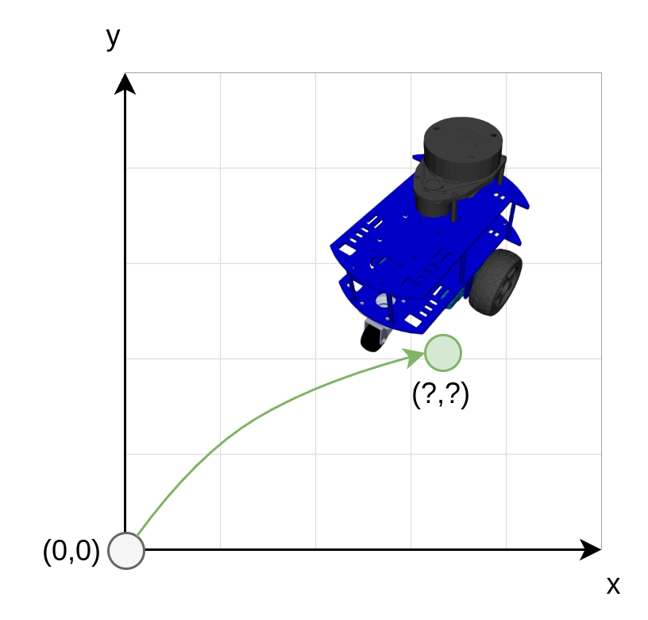
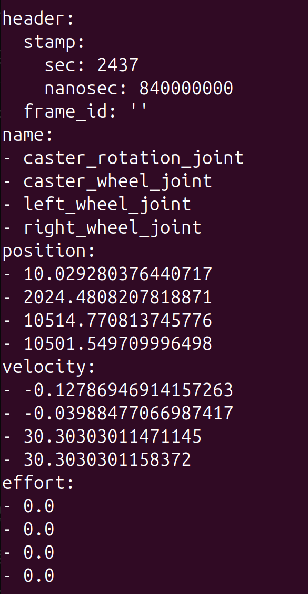
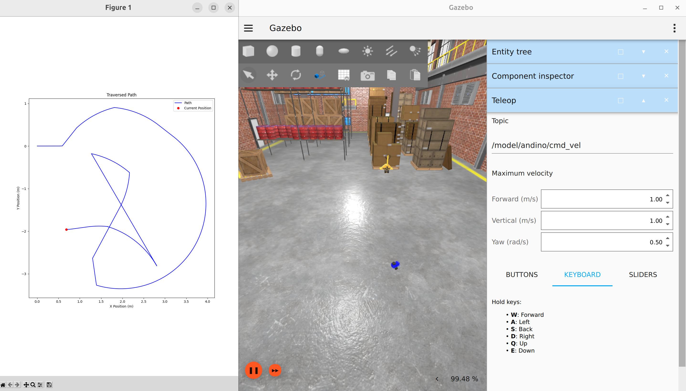

# Exercises 4 - Robot Odometry
<!-- TOC -->
* [Exercises 4 - Robot Odometry](#exercises-4---robot-odometry)
    * [Common Types of Odometry Data](#common-types-of-odometry-data)
  * [Exercise: Calculate Odometry from Wheel Encoders](#exercise-calculate-odometry-from-wheel-encoders)
    * [Getting started](#getting-started-)
    * [Instructions](#instructions)
    * [Visualize the Driven Path](#visualize-the-driven-path)
    * [Test the Odometry](#test-the-odometry)
    * [Solution](#solution)
  * [Summary](#summary)
<!-- TOC -->


**Odometry** is a technique used to estimate a robot’s position and orientation over time.
It is one of the essential things in mobile robotics, as good odometry data is often the foundation for localization, mapping and navigation.
Problems in these features likely boil down to bad odometry data, which is
why it is important to understand how odometry is calculated and the basic assumptions it relies on.



_How far Andino has travelled? 
We can answer this question by knowing how much each wheel has rotated and using this information to calculate the odometry._

### Common Types of Odometry Data

Odometry can be estimated using data from the robot’s sensors.

- **Wheel Odometry:** Uses data from wheel encoders, which measure wheel rotations. By calculating how much each wheel has rotated, the robot can estimate how far it has moved.
- **Visual Odometry:** Uses cameras or depth sensors to estimate movement by analyzing changes in images as the robot moves.
- **Inertial Odometry:** Utilizes inertial measurement units (IMUs) that provide data on acceleration and rotational velocity to estimate position changes.
- **Sensor Fusion Odometry:** Combines multiple sources (e.g., wheel encoders, IMUs, cameras) for more accurate and reliable odometry.

## Exercise: Calculate Odometry from Wheel Encoders

In this practical exercise, we’ll learn how to calculate odometry using data from simulated wheel encoders. 
In simulation, Andino uses Gazebo's built-in `OdometryPublisher` plugin to publish odometry data, but here we’ll learn to do the same calculation ourselves using Python.

Andino publishes the robot's left and right wheel positions and velocities on the `/joint_states` topic. We’ll use this information to estimate the robot’s position and velocity over time, just as you would on a real robot.




_JointState message from Andino_

### Getting started 
To get started, copy-paste the following code below into your `OdometryPublisher` Node you created during the previous exercises.
The node is located in
`/home/<user>/exercises_ws/src/ros2_exercises/ros2_exercises/odometry_publisher.py`.

We will use this code as the starting point to publish our odometry data.

```
#!/usr/bin/env python3
import math
import matplotlib.pyplot as plt

import rclpy
from rclpy.node import Node
from tf_transformations import quaternion_from_euler

from geometry_msgs.msg import Quaternion
from nav_msgs.msg import Odometry
from sensor_msgs.msg import JointState


class OdometryPublisher(Node):

    def __init__(self):
        super().__init__("odometry_publisher")
        # Use these wheel parameters for odometry calculation on Andino
        self.wheel_separation = 0.137
        self.wheel_radius = 0.033

        # Initializing the robot position and time for robot odometry calculation
        self.x = 0.0  # Robot's position on x-axis
        self.y = 0.0  # Robot's position on y-axis
        self.theta = 0.0  # Robot's orientation angle
        self.last_time = self.get_clock().now()

        # TODO: Subscribe to /joint_states topic to listen to data from left and right wheels.
        #  The message type is JointState and quality of service can be set to 10.
        #  Use self.joint_states_callback as the subscription callback.

        # TODO: Create odometry publisher. Message type is Odometry, topic can be set to
        #  /robot_odometry (not to clash with the existing Andino odometry topic) and qos to 10.

    def joint_states_callback(self, joint_states):
        # TODO: Read left and right wheel velocities from the JointState message

        # TODO: Get the elapsed time since last odometry calculation, delta time (dt), in seconds.
        #  Save current time to self.last_time

        # TODO: The wheel velocities we read from the joint_states message are angular
        #  joint velocities (rad/s). Convert them to linear velocities for each wheel by multiplying
        #  them with a wheel radius. Then calculate the robot's linear and angular velocities
        #  with the following formulas:
        #  linear velocity = (vel right + vel left) / 2.0
        #  angular velocity = (vel right + vel left) / wheel separation

        # TODO: Now that we know how much time has elapsed since the last calculation,
        #  what was robot's previous orientation angle (theta) and with what speed the
        #  robot has moved, we can calculate the new position for the robot. Find out how to
        #  calculate this for x-axis, y-axis and robot's orientation theta, and
        #  update the values in self.x, self.y and self.theta.

        # TODO: Create new Odometry message and populate stamp and frame IDs. The parent frame
        #  ID is "odom" and child frame ID is "base_link".

        # TODO: Add the updated robot's position and orientation to the Odometry message

        # TODO: Add the updated linear and angular velocities in the Odometry message

        # TODO: Publish the odometry message


def main(args=None):
    rclpy.init(args=args)

    odometry_publisher = OdometryPublisher()

    try:
        rclpy.spin(odometry_publisher)
    except KeyboardInterrupt:
        pass

    odometry_publisher.destroy_node()
    rclpy.try_shutdown()


if __name__ == '__main__':
    main()

```

### Instructions

The Python code has different sections denoted with TODO-comments that you should complete.
- Fill in the missing code pieces
- Between each of the steps, we recommend to print out the values and drive the robot in simulation to see how they are changing over time.
This will give you a better understanding of the whole solution.
- For a better learning experience, we do not recommend using generative AI like chatGPT to finish this task.
- You can find the solution to this exercise below, but try to first solve it by your own.
Learning to code is most effective through the process of trial, error, and overcoming challenges.

To test your solution, run first the Andino simulation in a new terminal:

    ros2 launch andino_gz andino_gz.launch.py

In another terminal, make sure you've built and sourced your node:

    cd /home/user/exercises_ws/
    colcon build --symlink-install
    source install/setup.bash

And then run the node with:

    ros2 run ros2_exercises odometry_publisher --ros-args -p use_sim_time:=True

You can start and stop your node during development, without restarting the whole simulation.
You also don't have to rebuild the package after every change you make, thanks to `--symlink-install`. 
Rebuild is only needed if you stop the whole Docker container.

### Visualize the Driven Path

Once you are done with your solution, you can visualize the calculated odometry by drawing the robot positions.
This will help you to verify your solution and also get a better understanding how odometry data works, 
and what are the possible drawbacks of it.

To visualize the driven path using matplotlib, add the following class to your code:

```
class PathVisualizer:
    def __init__(self):
        plt.ion()
        self.fig, self.ax = plt.subplots()

        # Lock the aspect ratio and set equal scaling for x and y
        self.ax.set_aspect('equal', adjustable='box')

        self.path_x, self.path_y = [], []

    def visualize(self, x, y):
        # Store position history
        self.path_x.append(x)
        self.path_y.append(y)

        # Plot path
        self.ax.clear()
        self.ax.plot(self.path_x, self.path_y, 'b-', label='Path')
        self.ax.plot(x, y, 'ro', label='Current Position')  # Mark current position
        self.ax.set_xlabel('X Position (m)')
        self.ax.set_ylabel('Y Position (m)')
        self.ax.set_title('Traversed Path')
        self.ax.legend()
        plt.draw()
        plt.pause(0.001)  # Short pause to update plot

```

Initialize it in `OdometryPublisher`'s init -function:


    self.path_visualizer = PathVisualizer()


And update it in the end of the `joint_states_callback` -function:

    self.path_visualizer.visualize(odom_msg.pose.pose.position.x, odom_msg.pose.pose.position.y)

### Test the Odometry

Drive the robot around in the simulation while visualizing the odometry data.

- Does the odometry data correspond precisely the driven path?
- Would the data be as precise on a real robot?
- Are you able to find situations where according to odometry data the robot is moving,
while in simulation it isn't. If so, what could you do to improve the odometry estimation?




### Solution
Before checking the full solution, make sure you've tried solving the exercise on your own.

<details>
  <summary>Click to open the solution</summary>


```
#!/usr/bin/env python3
import math
import matplotlib.pyplot as plt

import rclpy
from rclpy.node import Node
from tf_transformations import quaternion_from_euler

from geometry_msgs.msg import Quaternion
from nav_msgs.msg import Odometry
from sensor_msgs.msg import JointState


class OdometryPublisher(Node):

    def __init__(self):
        super().__init__("odometry_publisher")
        # Use these wheel parameters for odometry calculation on Andino
        self.wheel_separation = 0.137
        self.wheel_radius = 0.033

        # Initializing the robot position and time for robot odometry calculation
        self.x = 0.0  # Robot's position on x-axis
        self.y = 0.0  # Robot's position on y-axis
        self.theta = 0.0  # Robot's orientation angle
        self.last_time = self.get_clock().now()

        # Subscribe to /joint_states topic to listen to data from left and right wheels.
        #  The message type is JointState and quality of service can be set to 10.
        #  Use self.joint_states_callback as the subscription callback.
        self.joint_subscription = self.create_subscription(
            JointState, '/joint_states', self.joint_states_callback, 10
        )

        # Create odometry publisher. Message type is Odometry, topic can be set to
        #  /robot_odometry (not to clash with the existing Andino odometry topic) and qos to 10.
        self.odom_publisher = self.create_publisher(Odometry, "/robot_odometry", 10)

        self.path_visualizer = PathVisualizer()

    def joint_states_callback(self, joint_states):
        # Read left and right wheel velocities from the JointState message
        joint_names = joint_states.name
        left_wheel_index = joint_names.index("left_wheel_joint")
        right_wheel_index = joint_names.index("right_wheel_joint")
        left_wheel_vel = joint_states.velocity[left_wheel_index]
        right_wheel_vel = joint_states.velocity[right_wheel_index]

        # Get the elapsed time since last odometry calculation, delta time (dt), in seconds.
        #  Save current time to self.last_time
        current_time = self.get_clock().now()
        dt = (current_time - self.last_time).nanoseconds / 1e9
        self.last_time = current_time

        # The wheel velocities we read from the joint_states message are angular
        #  joint velocities (rad/s). Convert them to linear velocities for each wheel by multiplying
        #  them with a wheel radius. Then calculate the robot's linear and angular velocities
        #  with the following formulas:
        #  linear velocity = (vel right + vel left) / 2.0
        #  angular velocity = (vel right + vel left) / wheel separation
        v_left = left_wheel_vel * self.wheel_radius
        v_right = right_wheel_vel * self.wheel_radius
        linear_velocity = (v_right + v_left) / 2.0
        angular_velocity = (v_right - v_left) / self.wheel_separation

        # Now that we know how much time has elapsed since the last calculation,
        #  what was robot's previous orientation angle (theta) and with what speed the
        #  robot has moved, we can calculate the new position for the robot. Find out how to
        #  calculate this for x-axis, y-axis and robot's orientation theta, and
        #  update the values in self.x, self.y and self.theta.
        delta_x = linear_velocity * math.cos(self.theta) * dt
        delta_y = linear_velocity * math.sin(self.theta) * dt
        delta_theta = angular_velocity * dt

        self.x += delta_x
        self.y += delta_y
        self.theta += delta_theta

        # Create new Odometry message and populate stamp and frame IDs. The parent frame
        #  ID is "odom" and child frame ID is "base_link".
        odom_msg = Odometry()
        odom_msg.header.stamp = current_time.to_msg()
        odom_msg.header.frame_id = "odom"
        odom_msg.child_frame_id = "base_link"

        # Add the updated robot's position and orientation to the Odometry message
        odom_msg.pose.pose.position.x = self.x
        odom_msg.pose.pose.position.y = self.y
        odom_msg.pose.pose.position.z = 0.0
        odom_quat = quaternion_from_euler(0, 0, self.theta)
        odom_msg.pose.pose.orientation = Quaternion(
            x=odom_quat[0], y=odom_quat[1], z=odom_quat[2], w=odom_quat[3]
        )

        # Add the updated linear and angular velocities in the Odometry message
        odom_msg.twist.twist.linear.x = linear_velocity
        odom_msg.twist.twist.linear.y = 0.0
        odom_msg.twist.twist.angular.z = angular_velocity

        # Publish the odometry message
        self.odom_publisher.publish(odom_msg)

        self.path_visualizer.visualize(odom_msg.pose.pose.position.x, odom_msg.pose.pose.position.y)


class PathVisualizer:
    def __init__(self):
        plt.ion()
        self.fig, self.ax = plt.subplots()

        # Lock the aspect ratio and set equal scaling for x and y
        self.ax.set_aspect('equal', adjustable='box')

        self.path_x, self.path_y = [], []

    def visualize(self, x, y):
        # Store position history
        self.path_x.append(x)
        self.path_y.append(y)

        # Plot path
        self.ax.clear()
        self.ax.plot(self.path_x, self.path_y, 'b-', label='Path')
        self.ax.plot(x, y, 'ro', label='Current Position')  # Mark current position
        self.ax.set_xlabel('X Position (m)')
        self.ax.set_ylabel('Y Position (m)')
        self.ax.set_title('Traversed Path')
        self.ax.legend()
        plt.draw()
        plt.pause(0.001)  # Short pause to update plot


def main(args=None):
    rclpy.init(args=args)

    odometry_publisher = OdometryPublisher()

    try:
        rclpy.spin(odometry_publisher)
    except KeyboardInterrupt:
        pass

    odometry_publisher.destroy_node()
    rclpy.try_shutdown()


if __name__ == '__main__':
    main()

```
</details>

## Summary

By the end of these exercises, you have now learned

- What robot odometry is
- How to calculate robot's odometry data from wheel velocities
- How to use ROS 2 to subscribe and publish data in Python code