# Exercise 5 - Path Planning

Path planning in robotics is about finding the best route for a robot to move from a start point to a goal, avoiding obstacles along the way.
In ROS 2, this is typically achieved using the Nav2 stack, which combines sensor data, maps, and algorithms to calculate and execute paths dynamically.
Path planning is a core concept for autonomous navigation, enabling robots to operate in complex environments.

In this exercise, you will get an overview of what path planning is and how it is implemented in ROS 2.
You will implement a "Hello World" of the path planning, by creating the simplest form of planner: **Straight Line Planner**.

Straight Line Planner will plan the path between two points, without considering any obstacles on the way.
This will give you an understanding of how new path planning algorithm can be implemented using ROS 2,
enabling you to take things further on your own.

<!-- TOC -->
* [Exercise 5 - Path Planning](#exercise-5---path-planning)
  * [Basic Concepts](#basic-concepts)
  * [Disclaimer on Docker](#disclaimer-on-docker)
  * [Nav2 on Andino](#nav2-on-andino)
  * [Straight Line Planner](#straight-line-planner)
    * [Change the Planner](#change-the-planner)
    * [Verify the planner changes](#verify-the-planner-changes)
    * [Create New Python Package](#create-new-python-package)
    * [Implement Straight Line Planner Node](#implement-straight-line-planner-node)
    * [Solution](#solution)
  * [Next steps](#next-steps)
  * [Summary](#summary)
<!-- TOC -->

## Basic Concepts

**Static Map**

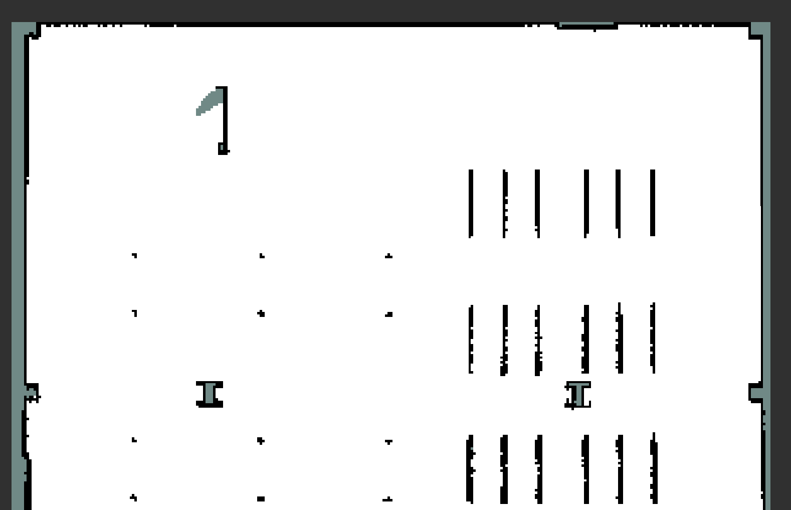

A 2D grid-based representation of the environment, where each cell is marked as free, occupied, or unknown. It is used for global navigation planning and obstacle avoidance.

**Global Costmap**

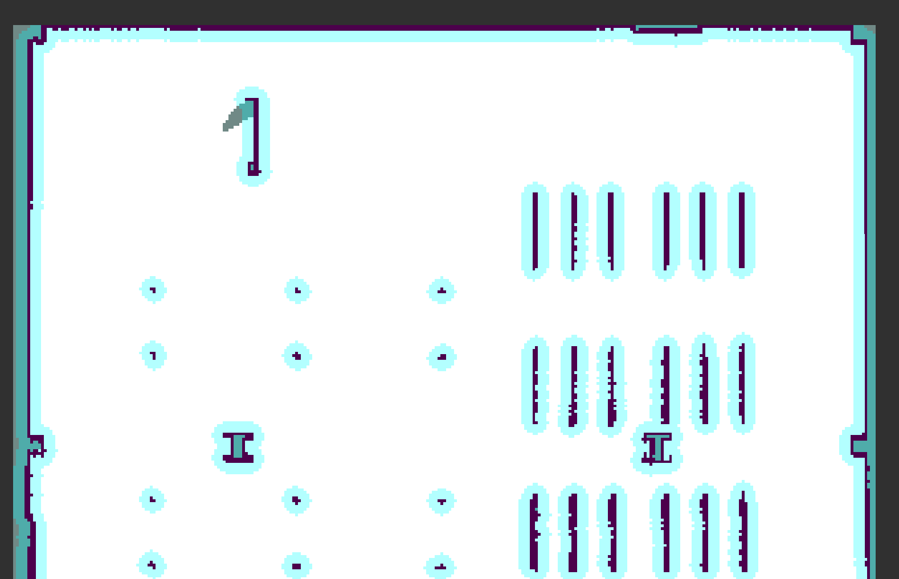

The global costmap represents the entire known environment, highlighting obstacles and free space. It helps the planner find a viable path at a high level.

**Local Costmap**

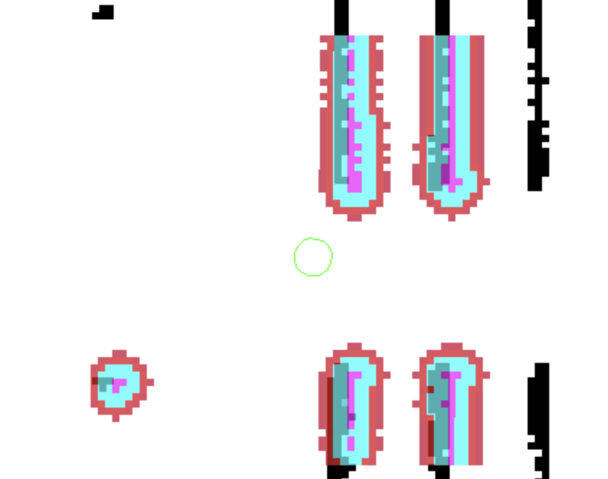

The local costmap focuses on the area immediately surrounding the robot. It dynamically updates with sensor data to handle unexpected obstacles and ensure safe navigation.

**Path Planner**

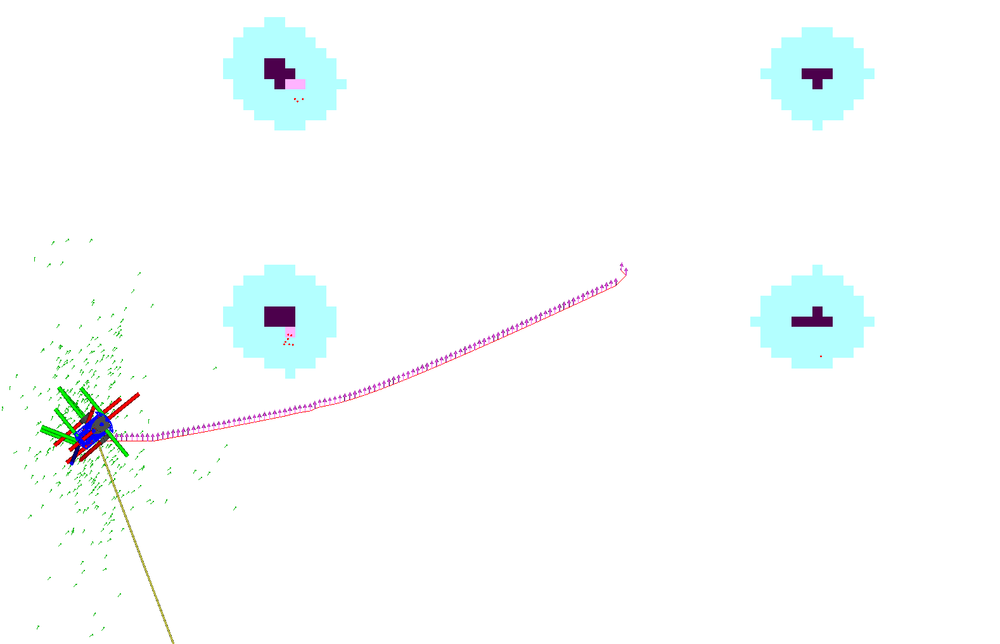

The path planner computes a path from the robot’s start point to its goal while considering the global costmap. In this exercise, you'll implement a basic straight-line planner to understand the fundamentals of path planning algorithms.
The produced path is often referred as "Global Plan".

**Controller**

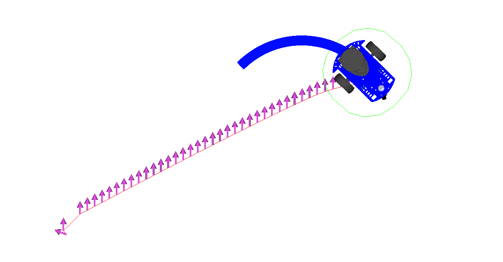

The controller translates the planned path into low-level motion commands, such as velocity and direction, to guide the robot in real-time.

**Behavior Trees**

Behavior trees define how the robot should react in different situations by structuring its actions and decisions hierarchically. They enable complex behaviors like re-planning when obstacles block the path.


## Disclaimer on Docker
By this point, we expect you to be familiar on how to start a Docker container using `docker compose up`,
and how to open a new terminal inside it using `exec`. 
From now on in the instructions, we won't necessarily separately specify to run the commands, or to open new terminal inside the Docker container.
All the commands are expected to be run inside the Docker, unless otherwise specified.

You can revise these commands from the [Docker Cheatsheet](/0-setup/Docker%20Cheat%20Sheet.md).

## Nav2 on Andino

As you have seen in previous demos, Nav2 has been integrated with Andino already.
In general, it is simple to take Nav2 and set it up with an existing robot.
Two main steps are needed to do this:
- Launch file that brings up Nav2 stack
- Parameter file that configures all the Nav2 parameters

Let's take a quick look on how these look like on Andino.


1. You can view the launch file with:

    ```
    ls $HOME/ros2_ws/src/andino_gz/andino_gz/launch/andino_gz.launch.py
    ```
    <aside>
    
    > Note: we are now using ros2_ws instead of exercises_ws.
    You can find here external dependencies used for this course, such as andino_gz
    
    </aside>
   
    Another way is to check the source code directly in the [Andino GitHub repository](https://github.com/Ekumen-OS/andino_gz/blob/humble/andino_gz/launch/andino_gz.launch.py)
    
    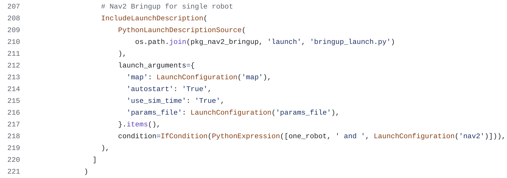
    
    This part invokes a Nav2 launch file called [bringup_launch.py](https://github.com/ros-navigation/navigation2/blob/main/nav2_bringup/launch/bringup_launch.py), that further
    starts all the nodes needed for navigation; planner, controller, behavior trees, etc.
    <br><br>
1. The second part of the Nav2 setup is the parameter file. You can view it with:
    
    ```
   cat $HOME/ros2_ws/src/andino_gz/andino_gz/config/nav2_params.yaml
    ```

    This file includes all the parameters that we pass for Nav2 nodes, for example for amcl, controller_server and planner_server.
    Take a moment to view what kind of parameters these Nodes take in.

## Straight Line Planner

Let's replace the existing path planner with our custom implementation.

Nav2, by default, supports adding new path planners by implementing a plugin with C++. 
To keep this course's programming language consistent, we are using Python instead. 
We have implemented for you a new C++ Nav2 plugin ([take a look at it here](/packages/custom_nav2_planner/src/custom_nav2_planner.cpp)) that requests a new plan by calling a ROS 2 service. 
This approach allows us to implement our path planner in Python by simply creating a service that:

- Waits for new service requests
- Gets a robot's starting pose and goal pose in a service request
- Responds with a plan

We also have access to global costmap, which normally would be used for path planning to plan around the obstacles,
but for simplicity we omit using it, and instead create a plan just between two points.

With all this information available, we are ready to start calculating new paths for our robot.

If you are interested to check the original implementation of the Straight Line Planner in C++, you can find it from the [Nav2 documentation](https://docs.nav2.org/plugin_tutorials/docs/writing_new_nav2planner_plugin.html).

### Change the Planner

Let's get started by manually changing the planner for Andino in Nav2 parameter file.


1. Open Andino's parameter file with your favorite text editor.
    We will use `nano` as an example:

    ```
    nano $HOME/ros2_ws/src/andino_gz/andino_gz/config/nav2_params.yaml
    ```

1. Find the place where `planner_server` parameters are set.
    Comment out the existing `planner_server` parameters and replace them with the following:
    ```
   planner_server:
     ros__parameters:
       plugins: ["GridBased"]
       use_sim_time: True
       GridBased:
         plugin: "custom_nav2_planner/CustomPlanner"
    ```
    The end result should look like this:
    
    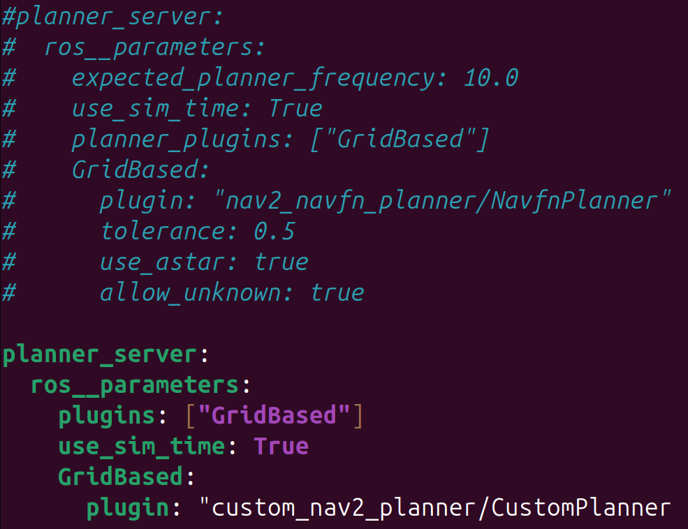

    This replaces the originally used `NavfnPlanner` with our [CustomPlanner](/packages/custom_nav2_planner/src/custom_nav2_planner.cpp) implementation.

1. Save the file by pressing CTRL-O and press ENTER.
1. Exit with CTRL+X
1. To apply the changes, finally build and source the `ros2_ws`:
   ```
   cd $HOME/ros2_ws/
   colcon build
   source install/setup.bash
   ```

<aside>

> Note! If you rebuild or remove your Docker container, these changes won't persist.
> In this case, you will have to run these steps to change the planner again!

</aside>

### Verify the planner changes

Next, we can verify that our planner has been indeed changed.

1. Launch your simulation with
    
   ```commandline
   ros2 launch andino_gz andino_gz.launch.py nav2:=True
   ```

1. Start the simulation, give a pose estimate for the robot, and try to give a Nav2 goal to autonomously navigate
    <br><br>
    You should see that your robot does not plan any path, since nothing yet is implemented.
    <br><br>

    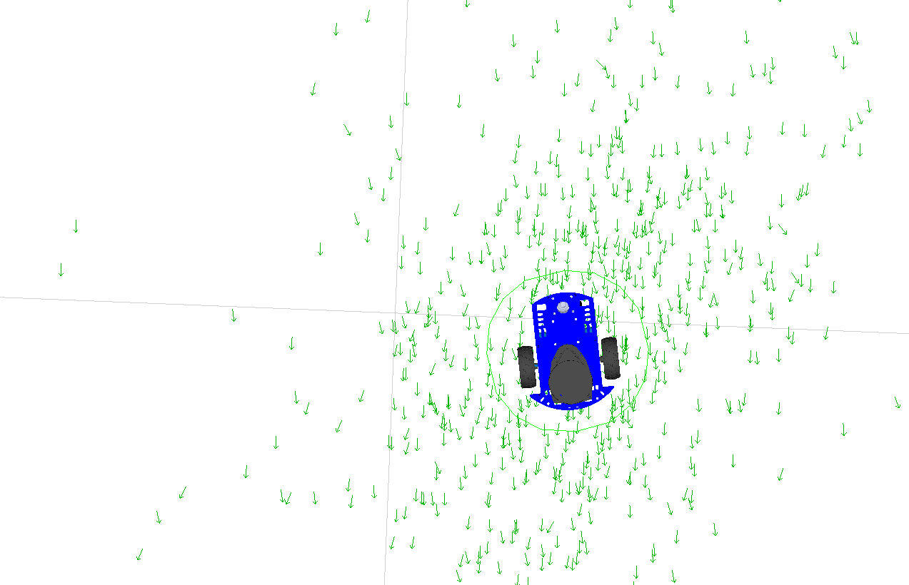
    
    You should also see logs like this:
    <br><br>
    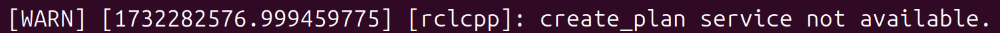


Exercise 1:

- Interestingly, few seconds after sending the goal, you will notice that your robot will start moving a little.
Why is that?

<details>
  <summary>Click to open the solution</summary>

  Nav2 has a behavior server running to have recovery behaviors if a plan could not be calculated.
  This is useful for example if the robot is stuck in a way that it is not possible to calculate the path, or the goal is not reachable.
  
  During recovery behaviors, the robot will for example try to spin and back up a little, to try to get unstuck.
</details>

### Create New Python Package

To create our code for the path planner, let's first create a new ROS 2 package.
You can stop your simulation launch with CTRL+C and follow these steps.

1. Run Turtle Nest:
   ```
   turtle-nest
   ```
2. Create a new package with the following options:
    - **Package Name**: `path_planner_example`
    - **Destination**: `/home/user/exercises_ws/src`
      - Note: exercises_ws, not ros2_ws
    - **Package type**: `Python`, uncheck C++
    - **Python Node Name**: `path_planner_node`
    - **License**: No Licence
    
    Rest of the fields you can leave empty.
3. Once the package has been created, build and source it:
   ```commandline
   cd $HOME/exercises_ws/
   colcon build --symlink-install
   source install/setup.bash
   ```
4. Verify that everything went smoothly by running the node:

   ```
   ros2 run path_planner_example path_planner_node --ros-args -p use_sim_time:=True
   ```
   
    You should see a Hello World message from your Node:
    
    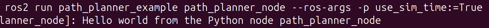


### Implement Straight Line Planner Node

Now, it is time to start implementing the actual code for the planner.

Open your Node in your favorite IDE.
You will find it on your host machine, outside the container in 
`$HOME/exercises_ws/src/path_planner_example/path_planner_example/path_planner_node.py`.

1. Copy-paste the code below into your new node as a starting point for your planner:

    ```
    #!/usr/bin/env python3
    import rclpy
    from rclpy.node import Node
    
    from nav_msgs.msg import Path
    from geometry_msgs.msg import PoseStamped
    from create_plan_msgs.srv import CreatePlan
    from nav2_simple_commander.robot_navigator import BasicNavigator
    
    
    class PathPlannerNode(Node):
    
        def __init__(self):
            super().__init__("path_planner_node")
            # self.basic_navigator = BasicNavigator()  # Can be uncommented to get Global Costmap in create_plan_cb
    
            # Creating a new service "create_plan", which is called by our Nav2 C++ planner plugin
            # to receive a plan from us.
            self.srv = self.create_service(CreatePlan, 'create_plan', self.create_plan_cb)
    
        def create_plan_cb(self, request, response):
            # Getting all the information to plan the path
            goal_pose = request.goal
            start_pose = request.start
            time_now = self.get_clock().now().to_msg()
            # global_costmap = self.basic_navigator.getGlobalCostmap()  # Can be uncommented to get Global CostMap

            print("----")
            print(f"Starting pose: ({start_pose.pose.position.x}, {start_pose.pose.position.y})")
            print(f"Goal pose: ({goal_pose.pose.position.x}, {goal_pose.pose.position.y}))")

            response.path = create_straight_plan(start_pose, goal_pose, time_now)
            return response
    
    def create_straight_plan(start, goal, time_now):
        """ 
        Creates a straight plan between start and goal points.
        Does not use global costmap to plan around obstacles, as normal planners would.
        """
        path = Path()
    
        # TODO Set the frame_id and stamp for the Path header. Use frame_id from the goal header,
        #  and time_now for the current time.
    
        # Let's create a straight plan between our start and goal poses.
        # It is not enough if we provide only the start and end positions as a path.
        # For controller to follow path correctly, we will need to provide also
        # points along this straight path with small intervals. There is a function
        # "interpolate_coordinates" implemented for you that does this. It only needs
        # the coordinates in a tuple format, for example:
        # interpolate_coordinates((0, 0), (0, 0.5))
        # This will give you coordinates between these two points with 0.1 interval:
        # [(0.0, 0.0), (0.0, 0.1), (0.0, 0.2), (0.0, 0.3), (0.0, 0.4), (0.0, 0.5)]
        # TODO Interpolate the coordinates between start and goal positions
        
        # TODO Loop through these interpolated coordinates and create a new PoseStamped()
        #  message for each of them. You can set the same stamp and frame_id as for the Path().
        #  Finally, add all of these points into the path.poses -array.
    
        return path
    
    def interpolate_coordinates(start, end, increment=0.1):
        """
        Interpolate coordinates between two points with a fixed increment.
    
        Args:
            start (tuple): Starting coordinate (x1, y1).
            end (tuple): Ending coordinate (x2, y2).
            increment (float): Distance between interpolated points.
    
        Returns:
            list: List of interpolated points as (x, y) tuples.
        """
        x1, y1 = start
        x2, y2 = end
    
        # Calculate total distance using the Euclidean formula
        dx = x2 - x1
        dy = y2 - y1
        distance = (dx ** 2 + dy ** 2) ** 0.5
    
        # Calculate the number of steps
        num_steps = int(distance / increment)
    
        # Generate interpolated points
        points = []
        for i in range(num_steps + 1):  # +1 to include the end point
            t = i / num_steps  # Normalized step (0.0 to 1.0)
            x = x1 + t * dx  # Linear interpolation for x
            y = y1 + t * dy  # Linear interpolation for y
            points.append((x, y))
    
        return points
    
    
    def main(args=None):
        rclpy.init(args=args)
        path_planner_node = PathPlannerNode()
    
        try:
            rclpy.spin(path_planner_node)
        except KeyboardInterrupt:
            pass
    
        path_planner_node.destroy_node()
        rclpy.try_shutdown()
    
    
    if __name__ == '__main__':
        main()
    
    ```

    Our newly created ROS node consists of 3 main parts:
    - **create_plan_cb():** This is our service callback.
    When Nav2 requests for a new path, this function will be called with a request containing the start position and goal position.

    - **create_straight_plan():** This is our main function to do the path planning in, and the only place you need to modify.
    Without any changes, it returns an empty path.

    - **interpolate_coordinates:** This function calculates intermediate points on a line between start and goal positions,
    with a 0.1 interval by default.
    You do not need to fully understand the contents of this function, only the way how it can be used.
1. Run the simulation in one terminal, and the new PathPlannerNode in another one with the following commands:
    ```
    ros2 launch andino_gz andino_gz.launch.py nav2:=True
    ```
    ```
    ros2 run path_planner_example path_planner_node --ros-args -p use_sim_time:=True
    ```
1. Start the simulation, give a pose estimation and a new Nav2 goal.
You will see your node now printing start and goal positions with a certain interval.
Nav2 keeps requesting replanning of the path periodically by default.
1. Go through the main parts of code and read the comments to understand what is currently implemented
1. Start following TODO's to fill up the parts that are missing to produce a full path


### Solution
The final solution should be able to create a straight path that the robot follows.


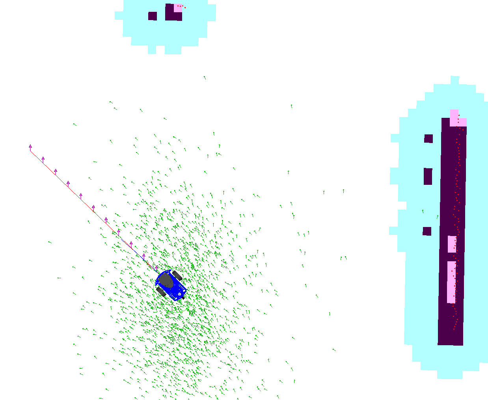
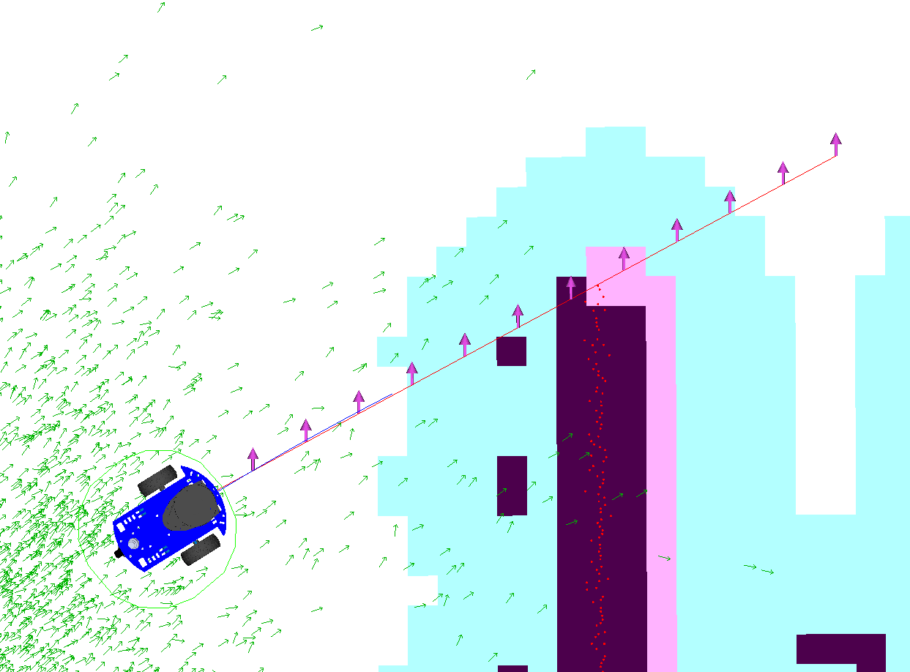

You can find the full solution below. 
Before checking it, make sure you've first tried solving the exercise on your own.

<details>
  <summary>Click to open the solution</summary>

```
#!/usr/bin/env python3
import rclpy
from rclpy.node import Node

from nav_msgs.msg import Path
from geometry_msgs.msg import PoseStamped
from create_plan_msgs.srv import CreatePlan
from nav2_simple_commander.robot_navigator import BasicNavigator


class PathPlannerNode(Node):

    def __init__(self):
        super().__init__("path_planner_node")
        # self.basic_navigator = BasicNavigator()  # Can be uncommented to get Global Costmap in create_plan_cb

        # Creating a new service "create_plan", which is called by our Nav2 C++ planner plugin
        # to receive a plan from us.
        self.srv = self.create_service(CreatePlan, 'create_plan', self.create_plan_cb)

    def create_plan_cb(self, request, response):
        # Getting all the information to plan the path
        goal_pose = request.goal
        start_pose = request.start
        time_now = self.get_clock().now().to_msg()
        # global_costmap = self.basic_navigator.getGlobalCostmap()  # Can be uncommented to get Global CostMap

        response.path = create_straight_plan(start_pose, goal_pose, time_now)
        return response

def create_straight_plan(start, goal, time_now):
    """ 
    Creates a straight plan between start and goal points.
    Does not use global costmap to plan around obstacles, as normal planners would.
    """
    path = Path()

    # Set the frame_id and stamp for the Path header. Use frame_id from the goal header,
    #  and time_now for the current time.
    path.header.frame_id = goal.header.frame_id
    path.header.stamp = time_now

    # Let's create a straight plan between our start and goal poses.
    # It is not enough if we provide only the start and end positions as a path.
    # For controller to follow path correctly, we will need to provide also
    # points along this straight path with small intervals. There is a function
    # "interpolate_coordinates" implemented for you that does this. It only needs
    # the coordinates in a tuple format, for example:
    # interpolate_coordinates((0, 0), (0, 0.5))
    # This will give you coordinates between these two points with 0.1 interval:
    # [(0.0, 0.0), (0.0, 0.1), (0.0, 0.2), (0.0, 0.3), (0.0, 0.4), (0.0, 0.5)]
    # Interpolate the coordinates between start and goal positions
    interpolated_coordinates = interpolate_coordinates(
        (start.pose.position.x, start.pose.position.y),
        (goal.pose.position.x, goal.pose.position.y),
    )
    
    # Loop through these interpolated coordinates and create a new PoseStamped()
    #  message for each of them. You can set the same stamp and frame_id as for the Path().
    #  Finally, add all of these points into the path.poses -array.
    for point in interpolated_coordinates:
        pose = PoseStamped()
        pose.pose.position.x = point[0]
        pose.pose.position.y = point[1]
        pose.header.stamp = time_now
        pose.header.frame_id = goal.header.frame_id
        path.poses.append(pose)

    return path

def interpolate_coordinates(start, end, increment=0.1):
    """
    Interpolate coordinates between two points with a fixed increment.

    Args:
        start (tuple): Starting coordinate (x1, y1).
        end (tuple): Ending coordinate (x2, y2).
        increment (float): Distance between interpolated points.

    Returns:
        list: List of interpolated points as (x, y) tuples.
    """
    x1, y1 = start
    x2, y2 = end

    # Calculate total distance using the Euclidean formula
    dx = x2 - x1
    dy = y2 - y1
    distance = (dx ** 2 + dy ** 2) ** 0.5

    # Calculate the number of steps
    num_steps = int(distance / increment)

    # Generate interpolated points
    points = []
    for i in range(num_steps + 1):  # +1 to include the end point
        t = i / num_steps  # Normalized step (0.0 to 1.0)
        x = x1 + t * dx  # Linear interpolation for x
        y = y1 + t * dy  # Linear interpolation for y
        points.append((x, y))

    return points


def main(args=None):
    rclpy.init(args=args)
    path_planner_node = PathPlannerNode()

    try:
        rclpy.spin(path_planner_node)
    except KeyboardInterrupt:
        pass

    path_planner_node.destroy_node()
    rclpy.try_shutdown()


if __name__ == '__main__':
    main()

```
</details>


## Next steps

If you wish, you can try to improve the path planning by also using the global costmap 
to plan around obstacles in the environment. You can for example implement some of the popular
path planning algorithms, such as **Dijkstra** or **A***. Good luck!

## Summary

By the end of these exercises, you have now learned:
- The basic navigation concepts
- How to modify Nav2 parameters
- How path planners work and are created in ROS 2