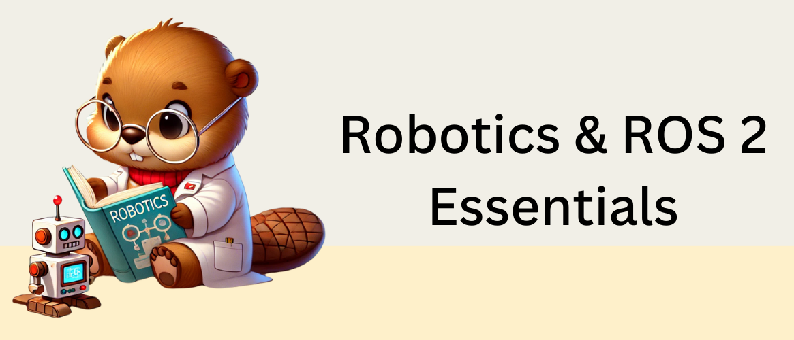
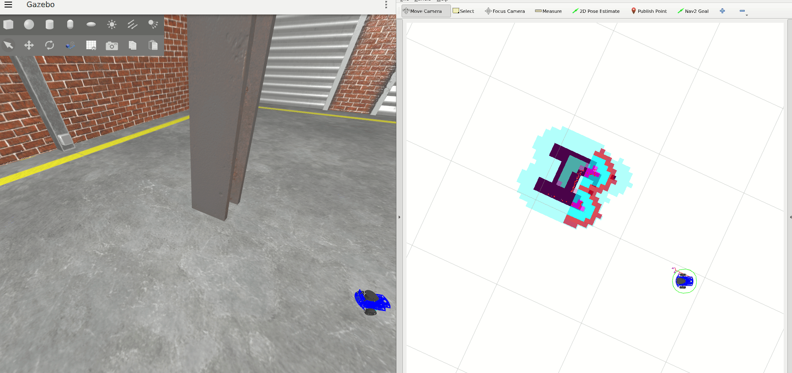

# Robotics & ROS 2 Essentials

Welcome to an open-source repository that contains materials and exercises needed 
to learn the essential robotics skills using ROS 2. 

This material is implemented for the 2024 iteration of the Master's level "Robotics & XR" course taught by 
[Dr. Ilkka Jormanainen](https://www.linkedin.com/in/ilkka-jormanainen-5954441/) at the [University of Eastern Finland](https://www.uef.fi/en), in collaboration with [Henki Robotics](https://henkirobotics.com/).

## Course overview

This course is designed to give you hands-on experience with the basics of robotics using ROS 2 and Gazebo simulation. 
The exercises focus on the [Andino robot](https://github.com/Ekumen-OS/andino_gz/tree/humble) from Ekumen and are structured to gradually introduce you to ROS 2 and Docker.

No prior experience with ROS 2 or Docker is needed, and since everything runs through Docker, you won’t need to install ROS 2 on your system beforehand. 
Along the way, you’ll learn essential concepts like autonomous navigation and mapping for mobile robots.
All the practical coding exercises are done in Python.

## Exercises

This repository contains a set of exercises to learn the core concepts taught over the course through practical demos and coding exercises. 
Start from the exercises "0 - Setup" and follow the exercises one by one to learn the basics of robotics and ROS 2!

0. [Setup](0-setup)
    - Setup the exercises
    - Run the Gazebo simulation 
    - Learn to use Docker
1. [ROS 2 Introduction](1-ros_2_introduction)
    - ROS 2 introduction
    - Gazebo and Rviz
    - ROS 2 topics; publish and subscribe
    - Transformations and tf-frames
2. [SLAM and Navigation Demo](2-slam_and_navigation_demo)
    - Create a map using slam-toolbox
    - Navigate autonomously using Nav2
    - ROS 2 services
3. [Create your first ROS 2 package](3-create_ros_2_package)
    - ROS 2 packages - how to create your own package
    - Building and sourcing
    - ROS 2 Nodes
4. [Robot Odometry](4-robot_odometry)
    - Calculate and publish your robot's odometry using wheel velocities
    - Robot odometry and how to calculate it
    - Publish and subscribe to topics from Python code
5. [Path Planning](5-path_planning)
    - Basic navigation concepts
    - Modify Nav2 parameters
    - Custom path planning using Nav2

## Lecture slides

These slides accompany the practical exercises included in this repository and are meant to be covered at the same time.

1. [Theme 1: Robotics in society](lecture_slides/theme_1_robotics_in_society)
2. [Theme 2: Robotics applications](lecture_slides/theme_2_robotics_applications)
3. [Theme 3: Robot control theory](lecture_slides/theme_3_robot_control_theory)
4. [Theme 4: Navigation](lecture_slides/theme_4_navigation)
5. [Theme 5: Robotics & AI](lecture_slides/theme_5_robotics_ai)
6. [Theme 6: XR applications in Robotics](lecture_slides/theme_6_xr_applications_robotics)

## Contribute
Did you encounter a problem during your exercises, or did you find a mistake?
Report issues in the "Issues" section in GitHub, and we will help you.

If you've found a fix to an existing issue, you can open a new Pull Request to fix it and contribute to this course.
We highly appreciate all the contributions!

## Maintainers
This course and repository is maintained by the main team members and co-founders of 
[Henki Robotics Oy](https://henkirobotics.com/):
- Janne Karttunen. [LinkedIn](https://www.linkedin.com/in/janne-karttunen-a22375209/). 
[Github](https://github.com/Jannkar).
- George-Cosmin Porusniuc. [LinkedIn](https://www.linkedin.com/in/george-cosmin-porusniuc-89019a168/).
[Github](https://github.com/geoporus1).

## Acknowledgements
We want to thank the following individuals for helping us in developing part of the material for this course and for 
providing support with teaching the in-person version of the course during the "Robotics & XR" Master's level course at
the "University of Eastern Finland", in 2024 and 2025:
- Prof. [Ilkka Jormanainen](https://www.linkedin.com/in/ilkka-jormanainen-5954441/)
- [Md Sajib Pramanic](https://www.linkedin.com/in/md-sajib-pramanic/)
- [Haris Mashood](https://www.linkedin.com/in/harismashood/)
