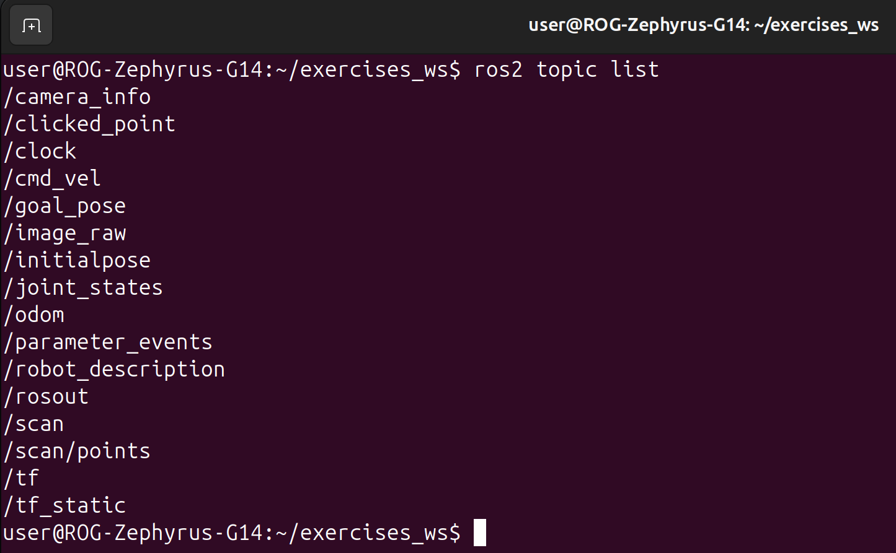
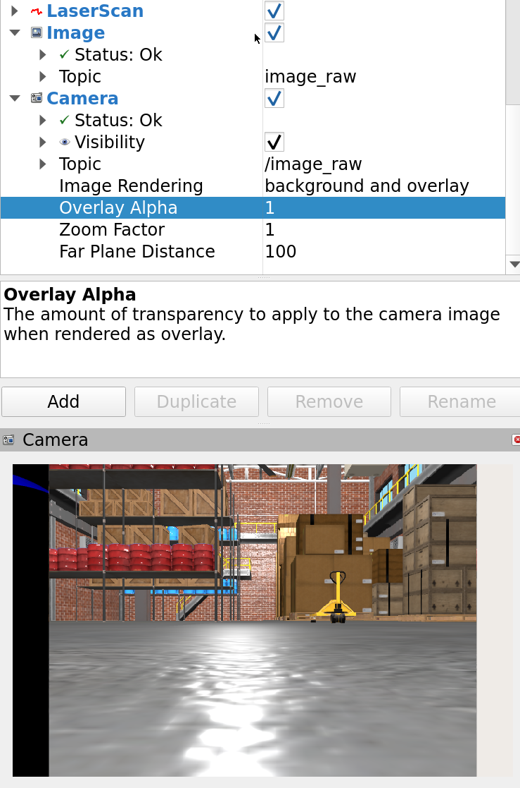
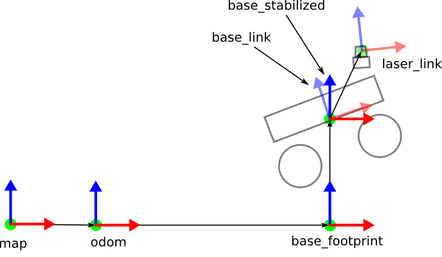

# Exercises 1 - ROS 2 introduction

In the first set of the exercises, we will showcase a demo of running a simulated robot, and control it using ROS 2.
You will also learn the very basics of ROS 2 topics and transforms.

<!-- TOC -->
* [Basic Concepts](#basic-concepts)
  * [ROS 2](#ros-2)
  * [Gazebo](#gazebo)
  * [Rviz](#rviz)
  * [Andino](#andino)
* [Launch Andino robot in Gazebo simulation](#launch-andino-robot-in-gazebo-simulation)
  * [Control the robot in Gazebo](#control-the-robot-in-gazebo)
* [ROS 2 Topics](#ros-2-topics)
  * [Subscribe to a topic](#subscribe-to-a-topic)
  * [Publish to a topic](#publish-to-a-topic)
* [RViz](#rviz-1)
  * [Subscribe to a new data source: Camera](#subscribe-to-a-new-data-source-camera)
  * [Changing the Fixed Frame](#changing-the-fixed-frame)
* [TFs - The coordinate transforms](#tfs---the-coordinate-transforms)
  * [Commonly used coordinate frames](#commonly-used-coordinate-frames)
* [Summary](#summary)
<!-- TOC -->


## Basic Concepts
### ROS 2


[ROS 2 (Robot Operating System 2)](https://www.ros.org/) is an open-source framework for building robot software.
It provides a set of tools, libraries, and conventions, including a middleware for internal communication. 
It is designed to support real-time performance and multi-robot systems.


### Gazebo


[Gazebo](https://gazebosim.org/home) is a powerful open-source robotics simulator that allows developers to test and validate robot designs in complex environments, offering realistic physics and sensor models.

### Rviz


[RViz](https://github.com/ros2/rviz) is a 3D visualization tool for ROS that enables developers to visualize sensor data, robot models, and environment maps, aiding in debugging and monitoring robot behavior.

### Andino


Andino is a fully open-source, educational low-cost robot by [Ekumen](https://github.com/Ekumen-OS/andino).
It uses ROS 2 to implement its functionalities and has a simulated [Gazebo version](https://github.com/Ekumen-OS/andino_gz) of it available.

## Launch Andino robot in Gazebo simulation

If you didn't yet, follow the instruction in [Exercises 0 - Setup](/exercises_0-setup/README.md) to setup and launch Andino Gazebo simulation with RViz.

Here is a quick summary of all the required steps for launching the simulation:

    cd robotics_essentials_ros2/docker/
    docker compose up -d
    docker exec -it robotics_essentials_ros2 bash
    ros2 launch andino_gz andino_gz.launch.py


### Control the robot in Gazebo

**Exercise 1:**
Open the teleop panel and give commands to robot to move it around
<br> 


## ROS 2 Topics

ROS 2 topics are a core communication mechanism in ROS 2 that enable data exchange in a publish/subscribe model. 
Publishers send messages to a named topic, while subscribers listen to that topic to receive relevant data.

### Subscribe to a topic
By subscribing to a topic, you can read sensor data (lidar, camera) and other useful data (map, odometry) from your robot.

[Open a new terminal inside the Docker container](/exercises_0-setup/README.md#new-terminal) and run the following commands:

1. List all the available ROS 2 topics
    ```commandline
    ros2 topic list
    ```
   
    

1. Read the sensor data from the laser scanner (Press CTRL+C to stop after a while). 
    ```commandline
    ros2 topic echo /scan
    ```
   

1. Get more info about the /scan topic to learn the message type
    ```commandline
    ros2 topic info /scan
    ```
   

### Publish to a topic
1. Move the robot by publishing to cmd_vel topic

    ```commandline
    ros2 topic pub /cmd_vel geometry_msgs/msg/Twist "{linear: {x: 0.2}}"
    ```

1. Send a 0-velocity command to stop the robot

    ```commandline
    ros2 topic pub /cmd_vel geometry_msgs/msg/Twist "{linear: {x: 0.0}}"
    ```
   
**Exercise 2:**

Publish a message to rotate the robot in its place. First, check what is the message type of the `/cmd_vel` topic using ros2 topic info command, and then check the possible message contents with `ros2 interface show <msg_type>`


<details>
    <summary>Solution:</summary>
    
- `ros2 topic info /cmd_vel` shows us that the message type is `geometry_msgs/msg/Twist`
- `ros2 interface show geometry_msgs/msg/Twist` shows us that we have angular.z field available, to make the robot rotate.
- We can rotate the robot with a command:


    ros2 topic pub /cmd_vel geometry_msgs/msg/Twist "{angular: {z: 0.5}}"
</details>


## RViz

RViz is a useful visualization tool that allows us to display data from ROS 2 topics.
With these examples, you will learn how to do that.

### Subscribe to a new data source: Camera

Our robot is constantly publishing images from the simulated camera. 

1. Click "Add" -button from the bottom left corner of RViz

1. Choose to create visualization "By topic"

1. Choose `Camera` under the `/image_raw` and Press ok.
    <br><br>
    

    **Tip:** Set overlay alpha to 1 to hide the artifacts on top of the image:
    
    

### Changing the Fixed Frame

1. Change the Fixed Frame from Global Options to "odom", to use odometry as the coordinate frame instead of the robot base_link frame.

    

2. Open the "Tree" under the TF menu to view the whole tf-tree for the coordinate frames

    **Tip:** You might need to press reset-button on bottom left, for the odom-frame to be correctly on top of the tree.
    
    

**Exercise 3:**
- What was the coordinate origin in RViz when the "Fixed Frame" was `base_link`?
- What is the coordinate origin now after we switched it to `odom`?

## TFs - The coordinate transforms

In ROS 2, transforms are used to describe the spatial relationships between different coordinate frames in a robotic system. 
They allow you to convert positions and orientations from one frame to another, which is crucial for tasks like navigation, sensor fusion, and manipulation.

The main component for handling transforms in ROS 2 is the tf2 library. It provides:
* Coordinate Frames: Each sensor or part of a robot has its own coordinate frame (e.g., the robot's base, sensors, end effectors).
* Transformations: These include translations (movement along axes) and rotations (change in orientation) between frames.

By using transforms, robots can effectively understand their position in the world and how their sensors and motors are located in relation to their body.


### Commonly used coordinate frames



_Image source: [wiki.ros.org](https://wiki.ros.org/hector_slam/Tutorials/SettingUpForYourRobot)_

**map**

The map frame provides a global reference point for the robot's environment, allowing it to understand its position within a larger context. 
Typically, the coordinates in the map frame present the robot's coordinates on a 2D map.

**odom**

The odom frame represents the robot's position based on its odometry data. 
It tracks the robot's movement from its starting point, being subject to drift and inaccuracies.

**base_footprint**

The base_footprint frame is a 2D representation of the robot's footprint on the ground, typically used for planning and movement calculations without considering the robot's height.

**base_link**

The base_link frame represents the robot's main body and is used as a reference for other components, such as sensors and arms.

**laser_link**

The laser_link frame denotes the position of a laser sensor on the robot. 
It is essential for interpreting the data collected by the laser for tasks like mapping and obstacle detection, providing a reference for where the sensor is located in relation to other frames.

## Summary

By the end of these exercises, you have now learned
- What are ROS 2, Gazebo, and Rviz
- How to launch Andino simulation and control the robot from Gazebo
- What ROS 2 topics are
- How to publish to a topic
- How to subscribe to a topic
- What tf-frames are