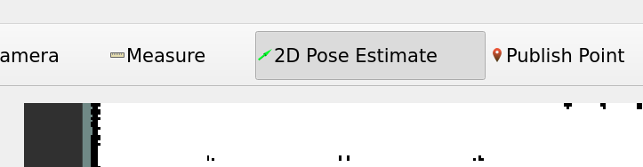
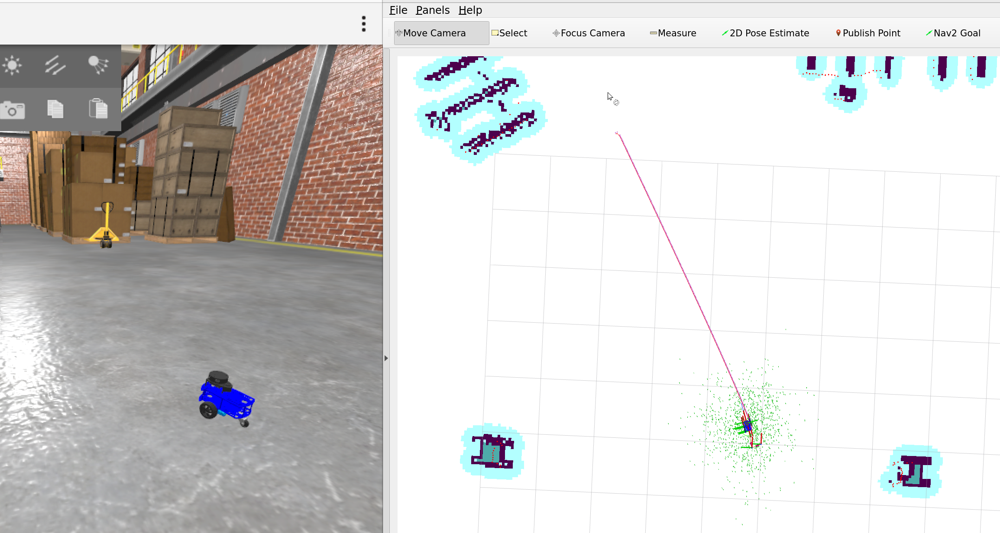

# Exercises 2 - SLAM and Navigation Demo

### Nav2
TODO

### AMCL
TODO

### Slam-toolbox
TODO

## Mapping demo

1. Run the simulation

    ```commandline
    ros2 launch andino_gz andino_gz.launch.py
    ```

1. Open a new terminal inside the docker container and run slam-toolbox
    
    ```commandline
    ros2 launch andino_gz slam_toolbox_online_async.launch.py
    ```
1. In RViz, subscribe to /map topic to view the map that is being built
    
    

1. Use Gazebo teleop to drive the robot around in the simulation and map the area.

    

    **Tip:** You can right-click the robot in simulation and choose "Follow" -camera mode to better keep track of your robot.

1. Once you are satisfied with the map, save it with:
    ```commandline
    ros2 run nav2_map_server map_saver_cli --free 0.15 --fmt png -f /home/user/andino_map
    ```

## Autonomous navigation demo

Before proceeding, stop any previous simulation or slam-toolbox runs with CTRL-C.

1. Launch the Andino simulation with Nav2
    ```commandline
    ros2 launch andino_gz andino_gz.launch.py nav2:=True
    ```

1. Navigation will start with a default Andino map. If you wish to switch to the map you just mapped, you can call a ROS 2 service:
   ```commandline
    ros2 service call /map_server/load_map nav2_msgs/srv/LoadMap "{map_url: /home/user/andino_map.yaml}"
   ```

1. Give a "2D Pose Estimate" for AMCL in RViz, so the robot has idea where it starts from.

    

    After this, you will see the robot's location on the map
    
1. Give a "Nav2 Goal" from RViz to start the autonomous navigation to a desired location on map. You will see the robot planning a path to the given location and start driving towards the goal
    
    


**Exercise 1:**

Play with Nav2 by giving different goals for the robot.
* Pay attention to what obstacles the robot is able to see with its laser scanner.
* Pay attention to the planned paths that the robot makes. Does it follow them always precisely?
* Are the planned paths always feasible? Does the robot get stuck?


## ROS 2 Services

TODO: In the navigation demo, you saw that we used a service to change a map...

TODO: Explain services briefly
